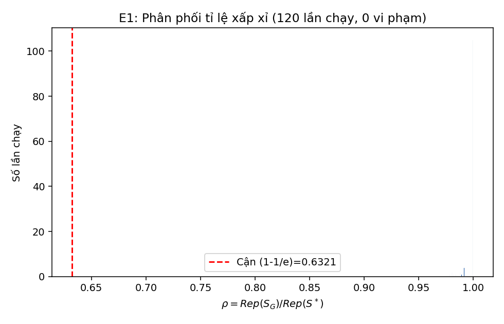
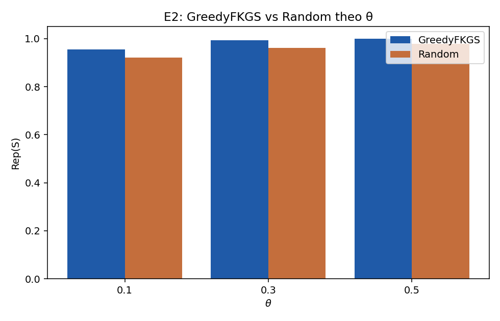
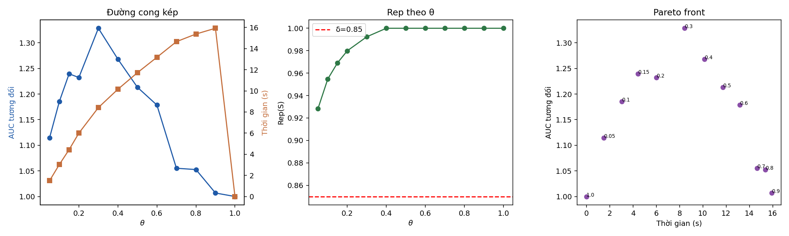
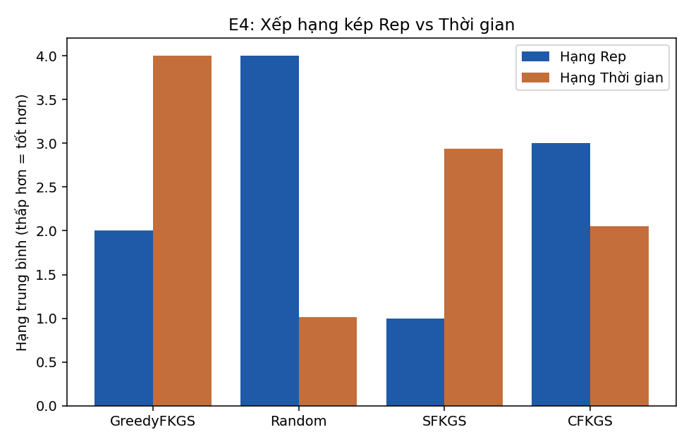

# Báo cáo kết quả thực nghiệm FKGS v2 (E1-E4)

## E1: Xác nhận lý thuyết (1-1/e)

**120 lần chạy, 0 vi phạm cận (1-1/e).** ✅ Không vi phạm nào -- đúng lý thuyết Nemhauser.

| n | m/n | rho trung bình | rho min | rho max | Cận (1-1/e) |
|---|---|---|---|---|---|
| 10 | 0.2 | 1.0000 | 1.0000 | 1.0000 | 0.6321 |
| 10 | 0.4 | 1.0000 | 1.0000 | 1.0000 | 0.6321 |
| 14 | 0.2 | 0.9978 | 0.9778 | 1.0000 | 0.6321 |
| 14 | 0.4 | 0.9965 | 0.9800 | 1.0000 | 0.6321 |
| 18 | 0.2 | 0.9975 | 0.9821 | 1.0000 | 0.6321 |
| 18 | 0.4 | 0.9988 | 0.9918 | 1.0000 | 0.6321 |

## E2: GreedyFKGS vs Random

| θ | n cặp (Rep) | Rep Greedy | Rep Random | p (Holm) | Cohen's d | AUC Greedy | AUC Random | p AUC (Holm) |
|---|---|---|---|---|---|---|---|---|
| 0.1000 | 150 | 0.9547 | 0.9202 | 0.0000 | 11.7494 | 0.5955 | 0.5437 | 0.1250 |
| 0.3000 | 150 | 0.9924 | 0.9609 | 0.0000 | 19.4916 | 0.6681 | 0.5337 | 0.0938 |
| 0.5000 | 150 | 1.0000 | 0.9781 | 0.0000 | 16.4767 | 0.6104 | 0.5195 | 0.1250 |

## E3: Đường cong theo θ

| θ | Rep (mean) | std | AUC tương đối | std | Thời gian (s) |
|---|---|---|---|---|---|
| 0.0500 | 0.9285 | 0.0024 | 1.1147 | 0.1100 | 1.4971 |
| 0.1000 | 0.9548 | 0.0020 | 1.1854 | 0.0942 | 3.0305 |
| 0.1500 | 0.9692 | 0.0018 | 1.2395 | 0.1234 | 4.4341 |
| 0.2000 | 0.9799 | 0.0010 | 1.2322 | 0.1198 | 5.9987 |
| 0.3000 | 0.9924 | 0.0010 | 1.3284 | 0.0093 | 8.4180 |
| 0.4000 | 1.0000 | 0.0000 | 1.2681 | 0.0530 | 10.1537 |
| 0.5000 | 1.0000 | 0.0000 | 1.2132 | 0.1159 | 11.7199 |
| 0.6000 | 1.0000 | 0.0000 | 1.1785 | 0.0873 | 13.1819 |
| 0.7000 | 1.0000 | 0.0000 | 1.0551 | 0.0916 | 14.6611 |
| 0.8000 | 1.0000 | 0.0000 | 1.0526 | 0.0891 | 15.3814 |
| 0.9000 | 1.0000 | 0.0000 | 1.0068 | 0.0136 | 15.9292 |
| 1.0000 | 1.0000 | 0.0000 | 1.0000 | 0.0000 | 0.0000 |

**Theta tối thiểu đạt Rep≥0.85:** 0.05  
**Điểm gối (Kneedle):** θ=0.9

## E4: So sánh 4 chiến lược

Friedman: stat=150.0000, p=0.000000 (trên 50 block).
Critical Difference (Nemenyi)=0.6633. Cặp khác biệt có ý nghĩa: GreedyFKGS vs Random, GreedyFKGS vs SFKGS, GreedyFKGS vs CFKGS, Random vs SFKGS, Random vs CFKGS, SFKGS vs CFKGS

**Giới hạn:** 10 block/fold là mẫu con độc lập từ CÙNG một nguồn dữ liệu tiểu đường -- kết luận chỉ áp dụng cho bộ dữ liệu này, không suy rộng đa lĩnh vực.

| Phương pháp | Hạng Rep (1=tốt nhất) | Hạng Thời gian (1=nhanh nhất) |
|---|---|---|
| GreedyFKGS | 2.00 | 4.00 |
| Random | 4.00 | 1.01 |
| SFKGS | 1.00 | 2.94 |
| CFKGS | 3.00 | 2.05 |

