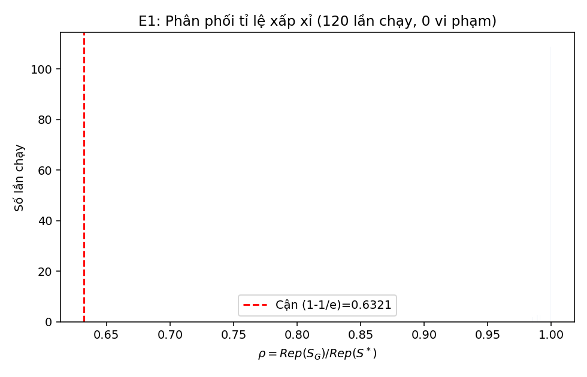
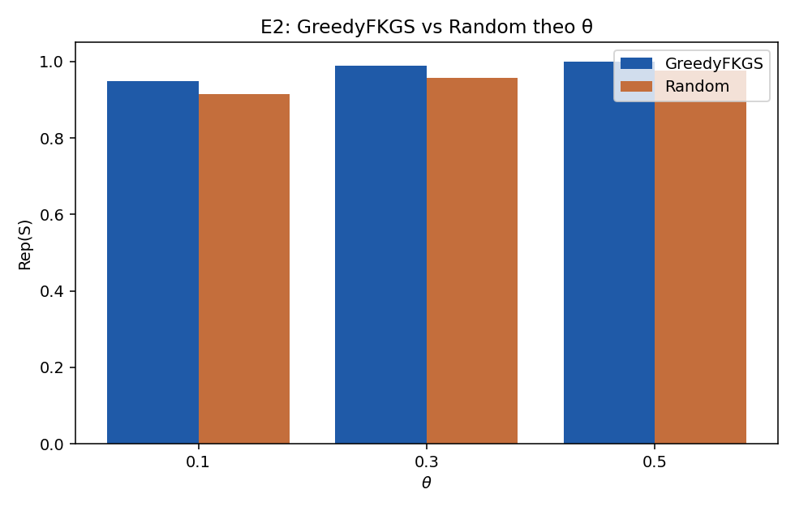
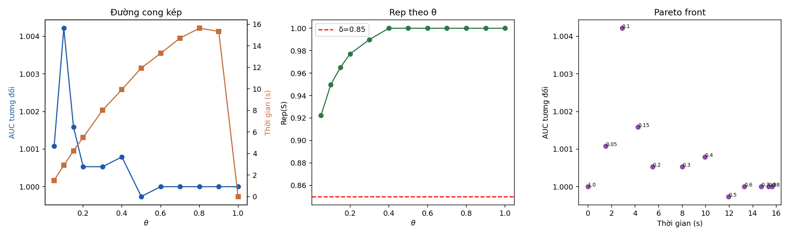
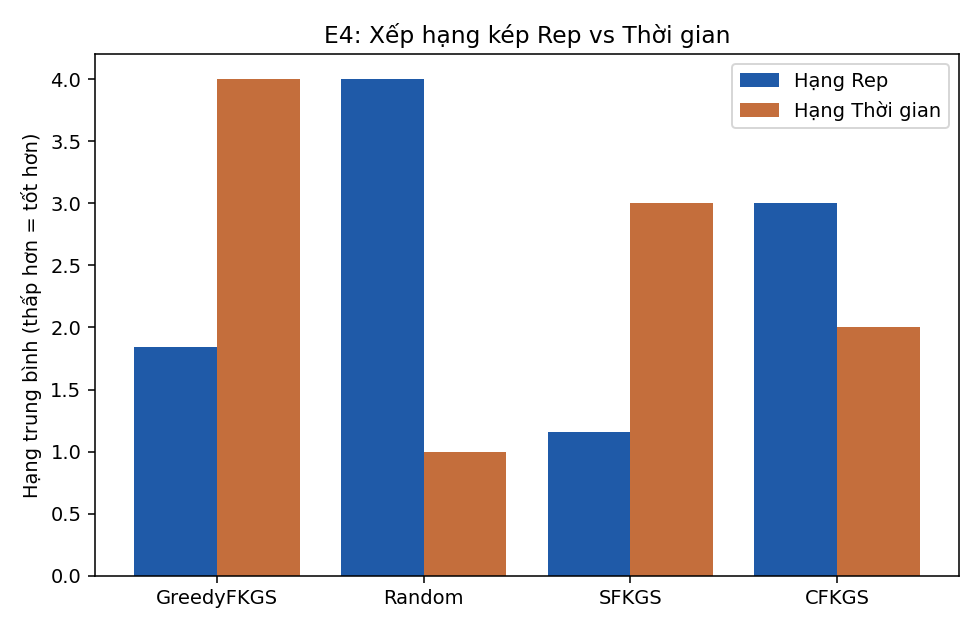

# Báo cáo kết quả thực nghiệm FKGS v2 (E1-E4)

## E1: Xác nhận lý thuyết (1-1/e)

**120 lần chạy, 0 vi phạm cận (1-1/e).** ✅ Không vi phạm nào -- đúng lý thuyết Nemhauser.

| n | m/n | rho trung bình | rho min | rho max | Cận (1-1/e) |
|---|---|---|---|---|---|
| 10 | 0.2 | 1.0000 | 1.0000 | 1.0000 | 0.6321 |
| 10 | 0.4 | 0.9985 | 0.9851 | 1.0000 | 0.6321 |
| 14 | 0.2 | 0.9995 | 0.9891 | 1.0000 | 0.6321 |
| 14 | 0.4 | 0.9989 | 0.9894 | 1.0000 | 0.6321 |
| 18 | 0.2 | 0.9987 | 0.9912 | 1.0000 | 0.6321 |
| 18 | 0.4 | 0.9988 | 0.9920 | 1.0000 | 0.6321 |

## E2: GreedyFKGS vs Random

| θ | n cặp (Rep) | Rep Greedy | Rep Random | p (Holm) | Cohen's d | AUC Greedy | AUC Random | p AUC (Holm) |
|---|---|---|---|---|---|---|---|---|
| 0.1000 | 150 | 0.9497 | 0.9150 | 0.0000 | 11.5611 | 0.5021 | 0.5003 | 0.2162 |
| 0.3000 | 150 | 0.9899 | 0.9574 | 0.0000 | 18.3195 | 0.5003 | 0.5000 | 0.4652 |
| 0.5000 | 150 | 1.0000 | 0.9759 | 0.0000 | 17.0818 | 0.4999 | 0.5000 | 0.8413 |

## E3: Đường cong theo θ

| θ | Rep (mean) | std | AUC tương đối | std | Thời gian (s) |
|---|---|---|---|---|---|
| 0.0500 | 0.9223 | 0.0021 | 1.0011 | 0.0036 | 1.4967 |
| 0.1000 | 0.9497 | 0.0012 | 1.0042 | 0.0028 | 2.8929 |
| 0.1500 | 0.9651 | 0.0010 | 1.0016 | 0.0025 | 4.2432 |
| 0.2000 | 0.9772 | 0.0008 | 1.0005 | 0.0024 | 5.4862 |
| 0.3000 | 0.9899 | 0.0007 | 1.0005 | 0.0024 | 8.0085 |
| 0.4000 | 1.0000 | 0.0000 | 1.0008 | 0.0027 | 9.9338 |
| 0.5000 | 1.0000 | 0.0000 | 0.9997 | 0.0005 | 11.9301 |
| 0.6000 | 1.0000 | 0.0000 | 1.0000 | 0.0000 | 13.2885 |
| 0.7000 | 1.0000 | 0.0000 | 1.0000 | 0.0000 | 14.7061 |
| 0.8000 | 1.0000 | 0.0000 | 1.0000 | 0.0000 | 15.6201 |
| 0.9000 | 1.0000 | 0.0000 | 1.0000 | 0.0000 | 15.3332 |
| 1.0000 | 1.0000 | 0.0000 | 1.0000 | 0.0000 | 0.0000 |

**Theta tối thiểu đạt Rep≥0.85:** 0.05  
**Điểm gối (Kneedle):** θ=0.8

## E4: So sánh 4 chiến lược

Friedman: stat=143.0806, p=0.000000 (trên 50 block).
Critical Difference (Nemenyi)=0.6633. Cặp khác biệt có ý nghĩa: GreedyFKGS vs Random, GreedyFKGS vs SFKGS, GreedyFKGS vs CFKGS, Random vs SFKGS, Random vs CFKGS, SFKGS vs CFKGS

**Giới hạn:** 10 block/fold là mẫu con độc lập từ CÙNG một nguồn dữ liệu tiểu đường -- kết luận chỉ áp dụng cho bộ dữ liệu này, không suy rộng đa lĩnh vực.

| Phương pháp | Hạng Rep (1=tốt nhất) | Hạng Thời gian (1=nhanh nhất) |
|---|---|---|
| GreedyFKGS | 1.84 | 4.00 |
| Random | 4.00 | 1.00 |
| SFKGS | 1.16 | 3.00 |
| CFKGS | 3.00 | 2.00 |

