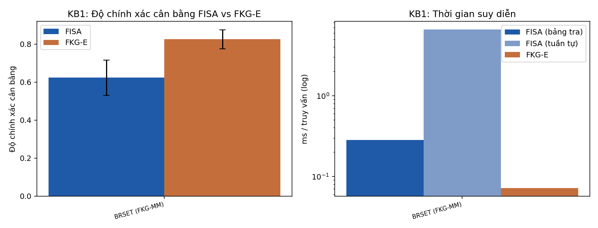
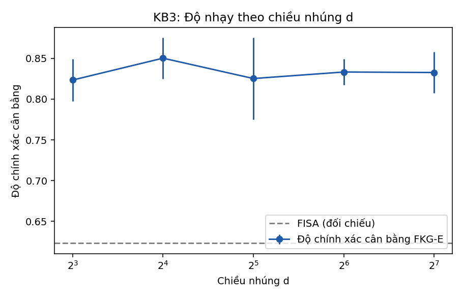
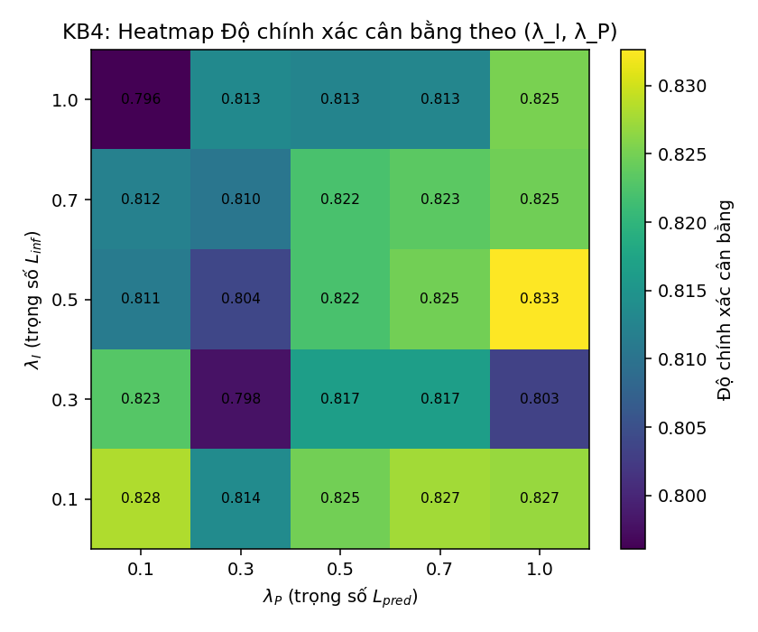
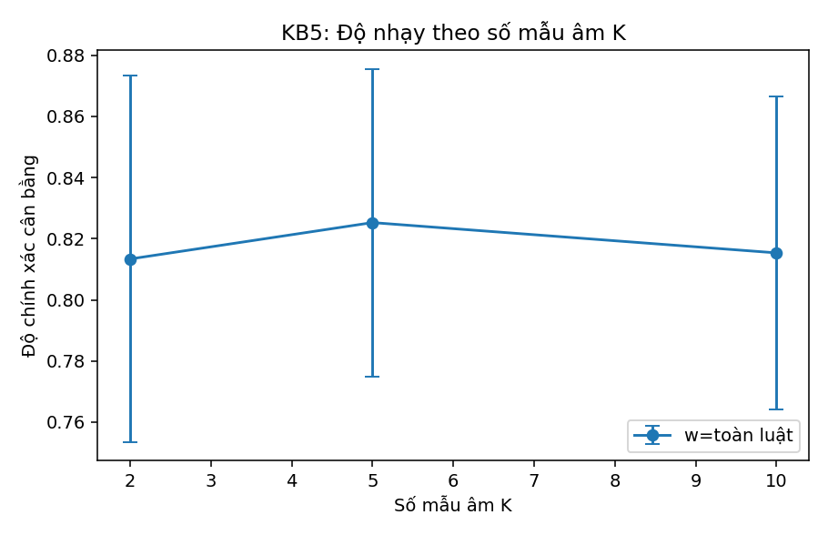
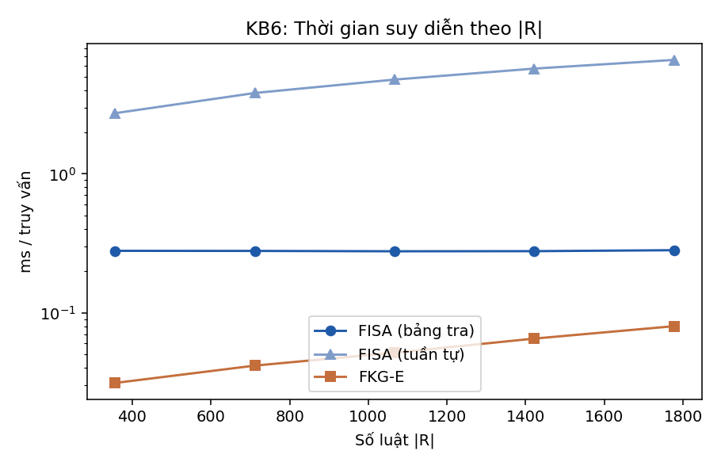
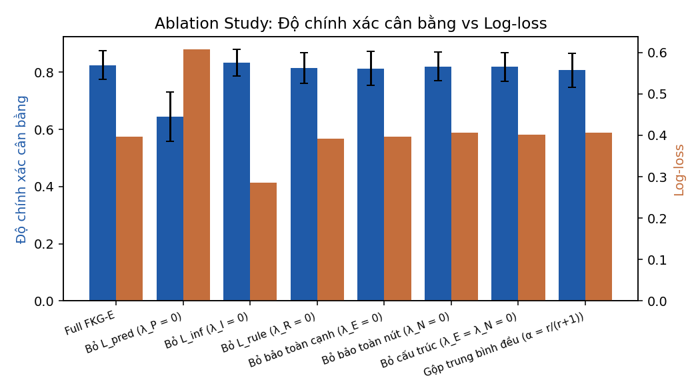
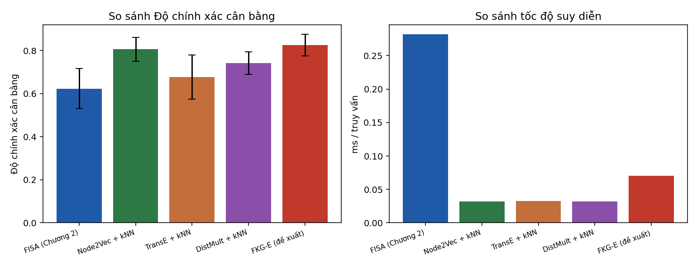

# Báo cáo kết quả thực nghiệm FKG-E

**Nguồn dữ liệu:** BRSET THẬT — 5 fold (fold_01, fold_02, fold_03, fold_04, fold_05) tại /home/buiduyhoang/Code FKG-E/FKGE-v3.2/fkge_v3/data_real/BRSET_Data; 1 seed FKG-E mỗi fold  
**Cấu hình:** T_ep = 200; độ đo chính của biểu đồ: Độ chính xác cân bằng  
Mỗi số liệu FKG-E là trung bình trên các seed trong một fold rồi trung bình giữa các fold; cột std là độ lệch chuẩn giữa các fold. Tập kiểm tra BRSET chỉ khoảng 8% dương nên Accuracy của bộ phân loại "luôn đoán âm" ≈ 0,92 — đọc kết quả theo BalAcc và AUC.

## KB1: FKG-E vs FISA trên FKG gốc

| Bộ dữ liệu | Số fold | \|R\| | FISA Acc | FISA BalAcc | FISA AUC | FISA F1 | FISA bảng tra ms | FISA tuần tự ms | FKG-E Acc | std | FKG-E BalAcc | std | FKG-E AUC | std | FKG-E F1 | Đồng thuận FISA | Dev | FKG-E ms/query | Speedup / bảng tra | Speedup / tuần tự |
|---|---|---|---|---|---|---|---|---|---|---|---|---|---|---|---|---|---|---|---|---|
| BRSET (FKG-MM) | 5 | 1778 | 0.5853 | 0.6232 | 0.8484 | 0.4513 | 0.2819 | 6.6164 | 0.8700 | 0.0623 | 0.8253 | 0.0503 | 0.9209 | 0.0326 | 0.7163 | 0.6673 | 0.4028 | 0.0714 | 3.9456 | 92.6035 |

## KB2: FKG-E vs FISA trên FKGS đã lấy mẫu

| Cấu hình | \|R\| | FISA Acc | FISA BalAcc | FISA AUC | FKG-E Acc | FKG-E BalAcc | FKG-E AUC | FISA ms/query | FKG-E ms/query | Speedup |
|---|---|---|---|---|---|---|---|---|---|---|
| BRSET (FKG-MM đầy đủ) | 1778 | 0.5853 | 0.6232 | 0.8484 | 0.8700 | 0.8253 | 0.9209 | 0.2819 | 0.0718 | 3.9276 |
| BRSET (FKGS mô phỏng 30%) | 534 | 0.8035 | 0.6779 | 0.8402 | 0.8742 | 0.8238 | 0.9177 | 0.2788 | 0.0360 | 7.7387 |

**Kết luận:** CỘNG HƯỞNG (speedup tăng thêm khi kết hợp FKGS+FKG-E) — FKGS MÔ PHỎNG bằng lấy mẫu ngẫu nhiên 30% luật, chưa phải FKGS thật của Chương 2

## KB3: Độ nhạy theo chiều nhúng d

| d | Accuracy | std | BalAcc | std | AUC | std | ms/query | TG huấn luyện (s) | FISA Acc | FISA BalAcc | FISA AUC |
|---|---|---|---|---|---|---|---|---|---|---|---|
| 8 | 0.8312 | 0.0856 | 0.8234 | 0.0259 | 0.9131 | 0.0352 | 0.0538 | 145.0962 | 0.5853 | 0.6232 | 0.8484 |
| 16 | 0.8716 | 0.0525 | 0.8502 | 0.0252 | 0.9286 | 0.0180 | 0.0603 | 134.5265 | 0.5853 | 0.6232 | 0.8484 |
| 32 | 0.8700 | 0.0623 | 0.8253 | 0.0503 | 0.9209 | 0.0326 | 0.0717 | 107.1072 | 0.5853 | 0.6232 | 0.8484 |
| 64 | 0.8493 | 0.0659 | 0.8333 | 0.0161 | 0.9251 | 0.0249 | 0.0991 | 93.1311 | 0.5853 | 0.6232 | 0.8484 |
| 128 | 0.8659 | 0.0552 | 0.8326 | 0.0252 | 0.9291 | 0.0199 | 0.1669 | 69.5825 | 0.5853 | 0.6232 | 0.8484 |

## KB4: Độ nhạy theo (λ_I, λ_P)

| λ_I | λ_P | ρ = λ_I/λ_P | Accuracy | std | BalAcc | AUC | Đồng thuận FISA (R2) | Dev căn cứ luật (R3) |
|---|---|---|---|---|---|---|---|---|
| 0.1000 | 0.1000 | 1.0000 | 0.8751 | 0.0545 | 0.8283 | 0.9214 | 0.6374 | 0.4171 |
| 0.1000 | 0.3000 | 0.3333 | 0.8651 | 0.0521 | 0.8138 | 0.9292 | 0.6623 | 0.3934 |
| 0.1000 | 0.5000 | 0.2000 | 0.8684 | 0.0529 | 0.8249 | 0.9285 | 0.6474 | 0.4108 |
| 0.1000 | 0.7000 | 0.1429 | 0.8643 | 0.0605 | 0.8275 | 0.9279 | 0.6300 | 0.4295 |
| 0.1000 | 1.0000 | 0.1000 | 0.8634 | 0.0574 | 0.8270 | 0.9257 | 0.6258 | 0.4363 |
| 0.3000 | 0.1000 | 3.0000 | 0.8742 | 0.0595 | 0.8230 | 0.9043 | 0.6498 | 0.4058 |
| 0.3000 | 0.3000 | 1.0000 | 0.8891 | 0.0638 | 0.7979 | 0.9232 | 0.6415 | 0.4143 |
| 0.3000 | 0.5000 | 0.6000 | 0.8717 | 0.0499 | 0.8165 | 0.9259 | 0.6557 | 0.4018 |
| 0.3000 | 0.7000 | 0.4286 | 0.8709 | 0.0542 | 0.8166 | 0.9256 | 0.6548 | 0.4028 |
| 0.3000 | 1.0000 | 0.3000 | 0.8551 | 0.0744 | 0.8032 | 0.9245 | 0.6606 | 0.4037 |
| 0.5000 | 0.1000 | 5.0000 | 0.8444 | 0.0665 | 0.8113 | 0.8914 | 0.6763 | 0.3859 |
| 0.5000 | 0.3000 | 1.6667 | 0.8833 | 0.0766 | 0.8039 | 0.9174 | 0.6490 | 0.4085 |
| 0.5000 | 0.5000 | 1.0000 | 0.8725 | 0.0616 | 0.8221 | 0.9215 | 0.6698 | 0.3899 |
| 0.5000 | 0.7000 | 0.7143 | 0.8692 | 0.0587 | 0.8248 | 0.9235 | 0.6648 | 0.3964 |
| 0.5000 | 1.0000 | 0.5000 | 0.8560 | 0.0455 | 0.8326 | 0.9242 | 0.6284 | 0.4329 |
| 0.7000 | 0.1000 | 7.0000 | 0.8362 | 0.1006 | 0.8122 | 0.8827 | 0.6879 | 0.3757 |
| 0.7000 | 0.3000 | 2.3333 | 0.8866 | 0.0597 | 0.8105 | 0.9099 | 0.6457 | 0.4142 |
| 0.7000 | 0.5000 | 1.4000 | 0.8908 | 0.0519 | 0.8221 | 0.9193 | 0.6333 | 0.4235 |
| 0.7000 | 0.7000 | 1.0000 | 0.8667 | 0.0625 | 0.8235 | 0.9208 | 0.6689 | 0.3954 |
| 0.7000 | 1.0000 | 0.7000 | 0.8684 | 0.0600 | 0.8246 | 0.9225 | 0.6623 | 0.4041 |
| 1.0000 | 0.1000 | 10.0000 | 0.8758 | 0.0221 | 0.7961 | 0.8689 | 0.6366 | 0.4290 |
| 1.0000 | 0.3000 | 3.3333 | 0.8659 | 0.0640 | 0.8134 | 0.9027 | 0.6465 | 0.4175 |
| 1.0000 | 0.5000 | 2.0000 | 0.8817 | 0.0756 | 0.8126 | 0.9134 | 0.6539 | 0.4127 |
| 1.0000 | 0.7000 | 1.4286 | 0.8916 | 0.0521 | 0.8129 | 0.9170 | 0.6407 | 0.4263 |
| 1.0000 | 1.0000 | 1.0000 | 0.8700 | 0.0623 | 0.8253 | 0.9209 | 0.6673 | 0.4028 |

## KB5: Độ nhạy theo số mẫu âm K

| w (cửa sổ) | K (mẫu âm) | Accuracy | std | BalAcc | std | AUC | std |
|---|---|---|---|---|---|---|---|
| toàn luật | 2 | 0.8924 | 0.0511 | 0.8134 | 0.0599 | 0.9191 | 0.0335 |
| toàn luật | 5 | 0.8700 | 0.0623 | 0.8253 | 0.0503 | 0.9209 | 0.0326 |
| toàn luật | 10 | 0.8518 | 0.0823 | 0.8153 | 0.0513 | 0.9219 | 0.0331 |

## KB6: Khả năng mở rộng quy mô

| Tỉ lệ luật | \|R\| | FISA bảng tra ms | FISA tuần tự ms | FKG-E ms | FISA Acc | FKG-E Acc | FISA BalAcc | FKG-E BalAcc | FISA AUC | FKG-E AUC |
|---|---|---|---|---|---|---|---|---|---|---|
| 0.2000 | 356 | 0.2790 | 2.7328 | 0.0312 | 0.3559 | 0.9015 | 0.6311 | 0.8140 | 0.8368 | 0.9257 |
| 0.4000 | 712 | 0.2786 | 3.8231 | 0.0416 | 0.5696 | 0.8684 | 0.6532 | 0.8340 | 0.8371 | 0.9241 |
| 0.6000 | 1067 | 0.2769 | 4.7734 | 0.0516 | 0.4688 | 0.8708 | 0.6466 | 0.8402 | 0.8412 | 0.9238 |
| 0.8000 | 1422 | 0.2775 | 5.7260 | 0.0651 | 0.4679 | 0.8692 | 0.6462 | 0.8248 | 0.8483 | 0.9197 |
| 1.0000 | 1778 | 0.2819 | 6.6164 | 0.0800 | 0.5853 | 0.8700 | 0.6232 | 0.8253 | 0.8484 | 0.9209 |

**Lưu ý đọc kết quả:** nếu đường FISA (bảng tra) gần như phẳng còn FKG-E tăng theo |R|, đây là hệ quả đúng của việc FISA tiền tính ma trận trọng số một lần (Mệnh đề 3.2.11), KHÔNG phải dấu hiệu lỗi. FISA tuần tự (FISA gốc) tăng tuyến tính theo |R|.

## Ablation Study

| Biến thể | Accuracy | BalAcc | std | AUC | std | F1 | Log-loss | Đồng thuận FISA (R2) | Dev căn cứ luật (R3) |
|---|---|---|---|---|---|---|---|---|---|
| Full FKG-E | 0.8700 | 0.8253 | 0.0503 | 0.9209 | 0.0326 | 0.7163 | 0.3960 | 0.6673 | 0.4028 |
| Bỏ L_pred (λ_P = 0) | 0.7739 | 0.6449 | 0.0857 | 0.7328 | 0.0942 | 0.5613 | 0.6077 | 0.7020 | 0.3886 |
| Bỏ L_inf (λ_I = 0) | 0.8568 | 0.8331 | 0.0472 | 0.9278 | 0.0207 | 0.7014 | 0.2857 | 0.6325 | 0.4347 |
| Bỏ L_rule (λ_R = 0) | 0.8609 | 0.8155 | 0.0535 | 0.9194 | 0.0360 | 0.7056 | 0.3916 | 0.6846 | 0.5565 |
| Bỏ bảo toàn cạnh (λ_E = 0) | 0.8924 | 0.8134 | 0.0597 | 0.9189 | 0.0333 | 0.7348 | 0.3964 | 0.6366 | 0.4300 |
| Bỏ bảo toàn nút (λ_N = 0) | 0.8609 | 0.8203 | 0.0509 | 0.9226 | 0.0312 | 0.7033 | 0.4062 | 0.6698 | 0.4011 |
| Bỏ cấu trúc (λ_E = λ_N = 0) | 0.8659 | 0.8185 | 0.0496 | 0.9207 | 0.0330 | 0.7080 | 0.4017 | 0.6648 | 0.4060 |
| Gộp trung bình đều (α = r/(r+1)) | 0.8891 | 0.8070 | 0.0596 | 0.9274 | 0.0189 | 0.7341 | 0.4058 | 0.6481 | 0.4337 |

**Lưu ý:** nếu độ đo phân loại giống nhau giữa các biến thể nhưng Log-loss khác nhau, các thành phần vẫn có đóng góp thật về độ tin cậy dự đoán — không kết luận vội 'không có tác dụng'.

## So sánh Baseline (FISA / FKG-E / Node2Vec / TransE / DistMult)

| Phương pháp | Accuracy | BalAcc | std | AUC | std | F1 | TG huấn luyện (s) | ms/query |
|---|---|---|---|---|---|---|---|---|
| FISA (Chương 2) | 0.5853 | 0.6232 | 0.0932 | 0.8484 | 0.0319 | 0.4513 | 0.1314 | 0.2819 |
| Node2Vec + kNN | 0.8701 | 0.8063 | 0.0556 | 0.8782 | 0.0390 | 0.6995 | 0.9258 | 0.0319 |
| TransE + kNN | 0.8643 | 0.6764 | 0.1025 | 0.7533 | 0.0777 | 0.6360 | 1.1192 | 0.0324 |
| DistMult + kNN | 0.8618 | 0.7411 | 0.0522 | 0.8234 | 0.0533 | 0.6657 | 1.3459 | 0.0322 |
| FKG-E (đề xuất) | 0.8700 | 0.8253 | 0.0503 | 0.9209 | 0.0326 | 0.7163 | 107.1072 | 0.0704 |

