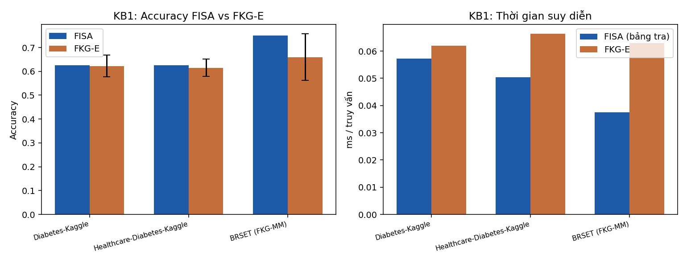
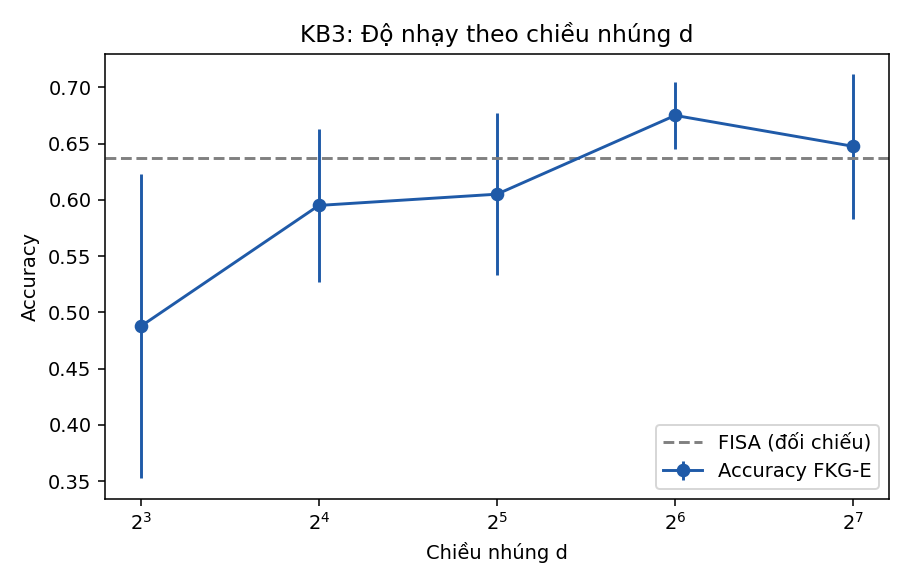
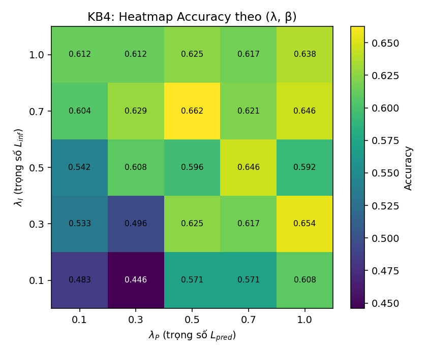
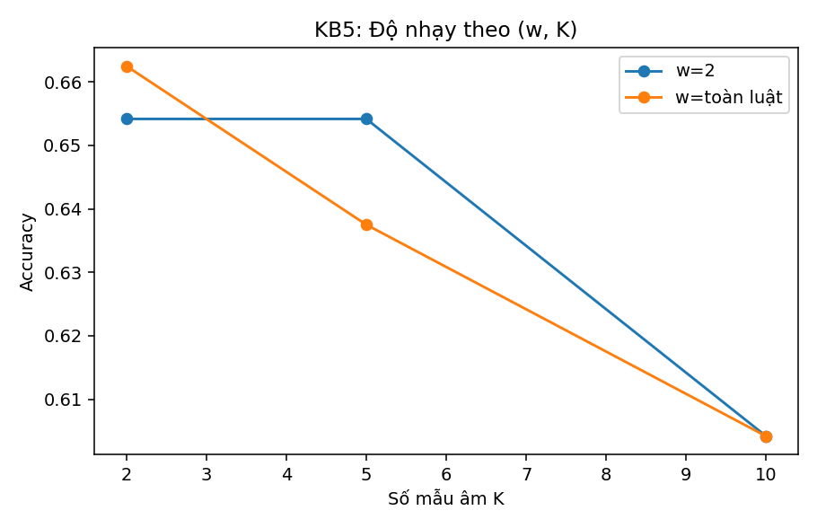
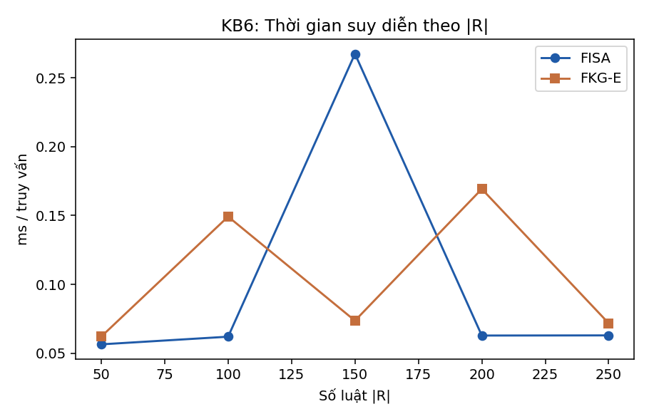
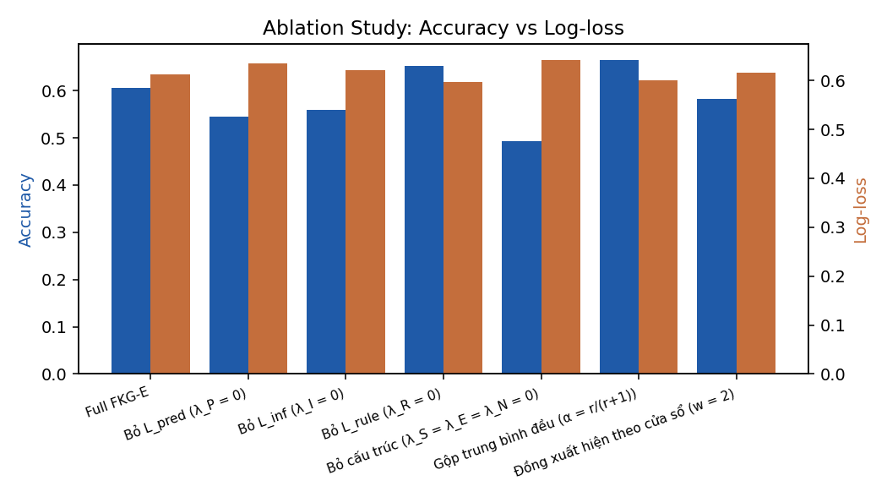
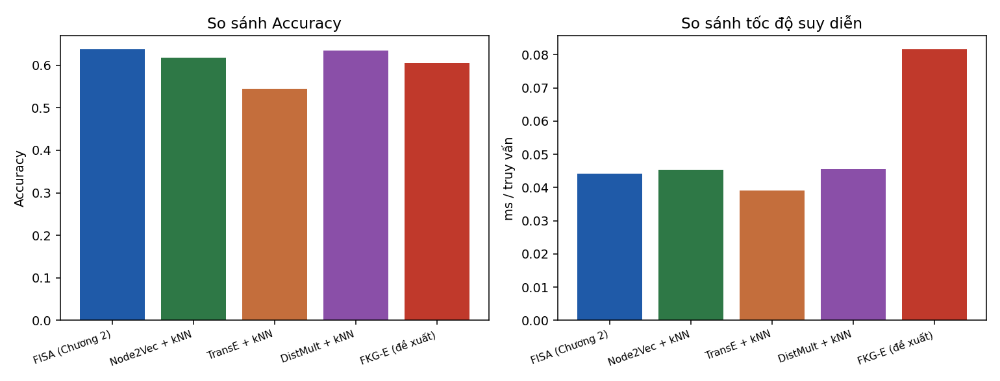

# Báo cáo kết quả thực nghiệm FKG-E

## KB1: FKG-E vs FISA trên FKG gốc

| Bộ dữ liệu | |R| | FISA Acc | FISA BalAcc | FISA AUC | FISA F1 | FISA bảng tra ms | FISA tuần tự ms | FKG-E Acc (mean) | std | FKG-E F1 | FKG-E ms/query | Speedup / bảng tra | Speedup / tuần tự |
|---|---|---|---|---|---|---|---|---|---|---|---|---|---|
| Diabetes-Kaggle | 250 | 0.6250 | 0.6538 | 0.7241 | 0.6229 | 0.0573 | 0.2269 | 0.6225 | 0.0457 | 0.5662 | 0.0619 | 0.9246 | 3.6628 |
| Healthcare-Diabetes-Kaggle | 250 | 0.6250 | 0.6331 | 0.6979 | 0.6000 | 0.0504 | 0.2275 | 0.6150 | 0.0366 | 0.5886 | 0.0664 | 0.7591 | 3.4245 |
| BRSET (FKG-MM) | 250 | 0.7500 | 0.7552 | 0.8262 | 0.7460 | 0.0376 | 0.2247 | 0.6600 | 0.0986 | 0.6471 | 0.0629 | 0.5975 | 3.5714 |

## KB2: FKG-E vs FISA trên FKGS đã lấy mẫu

| Cấu hình | |R| | FISA Acc | FKG-E Acc | Speedup |
|---|---|---|---|---|
| BRSET (FKG-MM đầy đủ) | 250 | 0.7500 | 0.6600 | 0.6645 |
| BRSET (FKGS đã nén) | 75 | 0.6750 | 0.6950 | 0.6429 |

**Kết luận:** TRUNG TÍNH/TRIỆT TIÊU (FKGS không làm tăng thêm lợi ích tốc độ của FKG-E)

## KB3: Độ nhạy theo chiều nhúng d

| d | Accuracy (mean) | std | ms/query | TG huấn luyện (s) | FISA Acc (đối chiếu) |
|---|---|---|---|---|---|
| 8 | 0.4875 | 0.1351 | 0.0707 | 0.3601 | 0.6375 |
| 16 | 0.5950 | 0.0683 | 0.0964 | 0.5191 | 0.6375 |
| 32 | 0.6050 | 0.0719 | 0.0686 | 0.5766 | 0.6375 |
| 64 | 0.6750 | 0.0296 | 0.2435 | 0.8376 | 0.6375 |
| 128 | 0.6475 | 0.0644 | 0.2209 | 1.0535 | 0.6375 |

## KB4: Độ nhạy theo (λ, β)

| λ_I | λ_P | ρ = λ_I/λ_P | Accuracy | std | Đồng thuận FISA (R2) | Dev căn cứ luật (R3) |
|---|---|---|---|---|---|---|
| 0.1000 | 0.1000 | 1.0000 | 0.4833 | 0.1124 | 0.4375 | 0.6721 |
| 0.1000 | 0.3000 | 0.3333 | 0.4458 | 0.0773 | 0.5083 | 0.6265 |
| 0.1000 | 0.5000 | 0.2000 | 0.5708 | 0.0312 | 0.6667 | 0.4893 |
| 0.1000 | 0.7000 | 0.1429 | 0.5708 | 0.0412 | 0.6583 | 0.5191 |
| 0.1000 | 1.0000 | 0.1000 | 0.6083 | 0.0514 | 0.6792 | 0.4940 |
| 0.3000 | 0.1000 | 3.0000 | 0.5333 | 0.1179 | 0.5958 | 0.5583 |
| 0.3000 | 0.3000 | 1.0000 | 0.4958 | 0.0868 | 0.6083 | 0.5436 |
| 0.3000 | 0.5000 | 0.6000 | 0.6250 | 0.0540 | 0.7292 | 0.4447 |
| 0.3000 | 0.7000 | 0.4286 | 0.6167 | 0.0156 | 0.6792 | 0.5056 |
| 0.3000 | 1.0000 | 0.3000 | 0.6542 | 0.0059 | 0.7250 | 0.4838 |
| 0.5000 | 0.1000 | 5.0000 | 0.5417 | 0.0948 | 0.6875 | 0.4979 |
| 0.5000 | 0.3000 | 1.6667 | 0.6083 | 0.0514 | 0.7125 | 0.4642 |
| 0.5000 | 0.5000 | 1.0000 | 0.5958 | 0.0156 | 0.7167 | 0.4844 |
| 0.5000 | 0.7000 | 0.7143 | 0.6458 | 0.0059 | 0.7250 | 0.4715 |
| 0.5000 | 1.0000 | 0.5000 | 0.5917 | 0.0793 | 0.6875 | 0.5214 |
| 0.7000 | 0.1000 | 7.0000 | 0.6042 | 0.0562 | 0.6917 | 0.4746 |
| 0.7000 | 0.3000 | 2.3333 | 0.6292 | 0.0212 | 0.7750 | 0.4525 |
| 0.7000 | 0.5000 | 1.4000 | 0.6625 | 0.0408 | 0.7333 | 0.4649 |
| 0.7000 | 0.7000 | 1.0000 | 0.6208 | 0.0580 | 0.7667 | 0.4369 |
| 0.7000 | 1.0000 | 0.7000 | 0.6458 | 0.0328 | 0.7833 | 0.4493 |
| 1.0000 | 0.1000 | 10.0000 | 0.6125 | 0.0530 | 0.7500 | 0.4489 |
| 1.0000 | 0.3000 | 3.3333 | 0.6125 | 0.0368 | 0.7583 | 0.4510 |
| 1.0000 | 0.5000 | 2.0000 | 0.6250 | 0.0445 | 0.7708 | 0.4448 |
| 1.0000 | 0.7000 | 1.4286 | 0.6167 | 0.0503 | 0.7625 | 0.4549 |
| 1.0000 | 1.0000 | 1.0000 | 0.6375 | 0.0530 | 0.7750 | 0.4604 |

## KB5: Độ nhạy theo (w, K)

| w (cửa sổ) | K (mẫu âm) | Accuracy | std |
|---|---|---|---|
| toàn luật | 2 | 0.6625 | 0.0270 |
| toàn luật | 5 | 0.6375 | 0.0530 |
| toàn luật | 10 | 0.6042 | 0.0212 |
| 2 | 2 | 0.6542 | 0.0580 |
| 2 | 5 | 0.6542 | 0.0680 |
| 2 | 10 | 0.6042 | 0.0460 |

## KB6: Khả năng mở rộng quy mô

| Tỉ lệ mẫu | |R| | FISA ms/query | FKG-E ms/query | FISA Acc | FKG-E Acc |
|---|---|---|---|---|---|
| 0.2000 | 50 | 0.0565 | 0.0621 | 0.6250 | 0.5875 |
| 0.4000 | 100 | 0.0620 | 0.1492 | 0.6125 | 0.5417 |
| 0.6000 | 150 | 0.2674 | 0.0737 | 0.6250 | 0.6417 |
| 0.8000 | 200 | 0.0629 | 0.1693 | 0.6875 | 0.6333 |
| 1.0000 | 250 | 0.0630 | 0.0718 | 0.6375 | 0.6375 |

**Lưu ý đọc kết quả:** nếu đường FISA gần như phẳng còn FKG-E tăng theo |R|, đây là hệ quả đúng của việc FISA tiền tính ma trận trọng số một lần (Mệnh đề 3.2.11), KHÔNG phải dấu hiệu lỗi.

## Ablation Study

| Biến thể | Accuracy | BalAcc | AUC | F1 | Log-loss | Đồng thuận FISA (R2) | Dev căn cứ luật (R3) |
|---|---|---|---|---|---|---|---|
| Full FKG-E | 0.6050 | 0.6296 | 0.6980 | 0.5878 | 0.6123 | 0.7325 | 0.4883 |
| Bỏ L_pred (λ_P = 0) | 0.5450 | 0.5892 | 0.6618 | 0.5229 | 0.6344 | 0.6725 | 0.5048 |
| Bỏ L_inf (λ_I = 0) | 0.5600 | 0.5963 | 0.6403 | 0.5415 | 0.6215 | 0.6575 | 0.5219 |
| Bỏ L_rule (λ_R = 0) | 0.6525 | 0.6688 | 0.7128 | 0.6368 | 0.5962 | 0.7800 | 0.5007 |
| Bỏ cấu trúc (λ_S = λ_E = λ_N = 0) | 0.4925 | 0.5623 | 0.6178 | 0.4801 | 0.6422 | 0.6700 | 0.5539 |
| Gộp trung bình đều (α = r/(r+1)) | 0.6650 | 0.6681 | 0.7140 | 0.6357 | 0.6006 | 0.7675 | 0.4195 |
| Đồng xuất hiện theo cửa sổ (w = 2) | 0.5825 | 0.6409 | 0.6793 | 0.5729 | 0.6168 | 0.7150 | 0.5027 |

**Lưu ý:** nếu Accuracy giống nhau giữa các biến thể nhưng Log-loss khác nhau, các thành phần vẫn có đóng góp thật về độ tin cậy dự đoán — không kết luận vội 'không có tác dụng'.

## So sánh Baseline (FISA / FKG-E / Node2Vec / TransE / DistMult)

| Phương pháp | Accuracy | F1 | TG huấn luyện (s) | ms/query |
|---|---|---|---|---|
| FISA (Chương 2) | 0.6375 | 0.6329 | 0.0026 | 0.0441 |
| Node2Vec + kNN | 0.6175 | 0.5631 | 2.8692 | 0.0452 |
| TransE + kNN | 0.5450 | 0.4715 | 0.5495 | 0.0391 |
| DistMult + kNN | 0.6350 | 0.5759 | 1.0747 | 0.0456 |
| FKG-E (đề xuất) | 0.6050 | 0.5878 | 0.4900 | 0.0816 |

