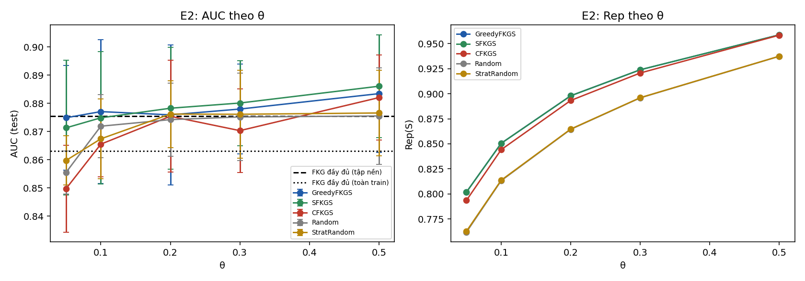
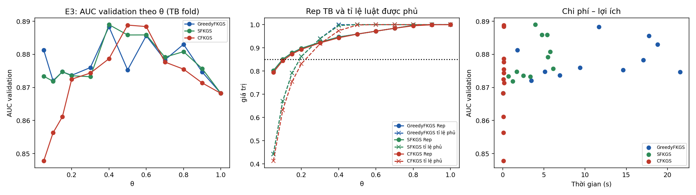
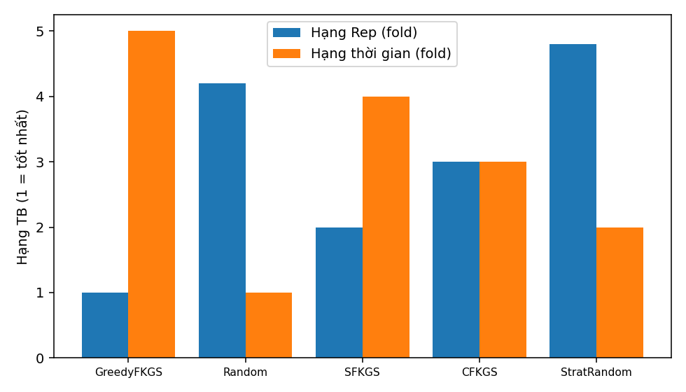

# Báo cáo thực nghiệm FKGS v3 — bộ dữ liệu `diabetes`

| Mục | Giá trị |
|---|---|
| run_id | `20261001T150454-96ebc024` |
| Mã nguồn (SHA-256 tổng hợp) | `300a2edd305b68d6…` |
| Dữ liệu | real `data\diabetes\Data.csv` SHA-256 `5236d580bcdeef7e…` |
| Tiền xử lý | 18536 dòng → 15778 sau loại 2758 trùng; nhãn {'0': 10506, '1': 5272}; X trùng khác nhãn: 0 |
| Chia dữ liệu | 5-fold phân tầng, seed 42; tập nền N_EXP=1500 |
| Điền giá trị thiếu | trung vị toàn cục của train (chỉ X), cùng quy tắc train/test |
| Nhân Sim / Rep | 1−Hamming cùng nhãn, −1 khác nhãn; Rep dùng max(0,Sim) |
| Mờ hoá | 3 mức theo phân vị [0.333, 0.667] của tập huấn luyện |
| FISA-P | PAIR_SCOPE=`global`; điểm s = log D1 − log D0; quyết định `calibrated` (tiêu chí `bacc`, tập xác thực 0.2 tập huấn luyện) |
| Ngân sách | `exact` (mọi phương pháp chọn đúng ceil(θn) luật) |
| Môi trường | Python 3.12.1, numpy 1.26.4, scipy 1.13.0, sklearn 1.7.0, Windows-11-10.0.26100-SP0 |
| Chế độ | đầy đủ |

## E1 — Kiểm chứng cận lý thuyết (RQ1)

120 mẫu con từ luật huấn luyện fold 0 (vét cạn). Cận 1−1/e = 0.6321.

| n | m | m/n thực | Greedy ρ TB / min | SFKGS Rep/OPT_pb min | SFKGS tỉ lệ cục bộ min | SFKGS max\|g\| | CFKGS Rep/OPT_pb min | CFKGS min g |
|---|---|---|---|---|---|---|---|---|
| 10 | 2 | 0.200 | 1.0000 / 1.0000 | 0.9767 | 0.9767 | 1.1e-16 | 1.0000 | -1.1e-16 |
| 10 | 4 | 0.400 | 0.9940 / 0.9483 | 0.9483 | 0.9032 | 1.1e-16 | 1.0000 | -1.1e-16 |
| 14 | 3 | 0.214 | 0.9879 / 0.9403 | 0.9403 | 0.9200 | 1.1e-16 | 1.0000 | 1.1e-16 |
| 14 | 6 | 0.429 | 0.9908 / 0.9663 | 0.9551 | 0.9200 | 1.1e-16 | 0.9881 | -1.1e-16 |
| 18 | 4 | 0.222 | 0.9884 / 0.9684 | 0.9684 | 0.9434 | 1.1e-16 | 1.0000 | 1.1e-16 |
| 18 | 7 | 0.389 | 0.9903 / 0.9732 | 0.9732 | 0.9429 | 1.1e-16 | 0.9818 | -1.1e-16 |

Số vi phạm: greedy=0, sfkgs=0, cfkgs=0, sfkgs_decomposition=0, cfkgs_negative_g=0, chain=0, classdev_sfkgs=0, classdev_cfkgs=0, greedy_above_opt=0, size_mismatch=0

## E2 — So sánh với FKG đầy đủ và lấy mẫu cơ sở, cùng ngân sách (RQ2)

Đơn vị suy luận: fold (n = số fold); Random/StratRandom lấy trung bình theo hạt giống trong fold. Các fold có tập huấn luyện chồng lấp nên p-value mang tính mô tả trong phạm vi bộ dữ liệu.

| Mốc | \|R\| | AUC | Balanced Acc | Accuracy | Acc (argmax) | BalAcc (argmax) |
|---|---|---|---|---|---|---|
| FKG đầy đủ (tập nền) | 1500 | 0.8755 ± 0.0187 | 0.8260 | 0.8395 | 0.6672 | 0.5020 |
| FKG đầy đủ (toàn train) | 10097 | 0.8631 ± 0.0077 | 0.8174 | 0.8422 | 0.6659 | 0.5000 |

| θ | Phương pháp | \|S\| | Rep | Tỉ lệ luật phủ (≥δ) | AUC | Accuracy | Balanced Acc | Lớp+ trong mẫu | t chọn (s) |
|---|---|---|---|---|---|---|---|---|---|
| 0.05 | GreedyFKGS | 75 | 0.8018 ± 0.0019 | 0.436 | 0.8749 ± 0.0186 | 0.8278 | 0.8275 | 0.341 | 2.298 |
| 0.05 | SFKGS | 75 | 0.8018 ± 0.0019 | 0.436 | 0.8713 ± 0.0239 | 0.8231 | 0.8215 | 0.333 | 0.757 |
| 0.05 | CFKGS | 75 | 0.7936 ± 0.0013 | 0.409 | 0.8498 ± 0.0154 | 0.8177 | 0.8015 | 0.333 | 0.044 |
| 0.05 | Random | 75 | 0.7619 ± 0.0021 | 0.274 | 0.8555 ± 0.0076 | 0.8103 | 0.8055 | 0.338 | 0.000 |
| 0.05 | StratRandom | 75 | 0.7627 ± 0.0014 | 0.277 | 0.8598 ± 0.0087 | 0.8148 | 0.8080 | 0.333 | 0.000 |
| 0.1 | GreedyFKGS | 150 | 0.8505 ± 0.0019 | 0.666 | 0.8771 ± 0.0256 | 0.8351 | 0.8255 | 0.344 | 4.310 |
| 0.1 | SFKGS | 150 | 0.8505 ± 0.0019 | 0.666 | 0.8749 ± 0.0235 | 0.8309 | 0.8240 | 0.333 | 1.328 |
| 0.1 | CFKGS | 150 | 0.8442 ± 0.0019 | 0.633 | 0.8656 ± 0.0115 | 0.8281 | 0.8154 | 0.333 | 0.048 |
| 0.1 | Random | 150 | 0.8132 ± 0.0013 | 0.458 | 0.8719 ± 0.0112 | 0.8231 | 0.8182 | 0.336 | 0.000 |
| 0.1 | StratRandom | 150 | 0.8137 ± 0.0013 | 0.461 | 0.8674 ± 0.0142 | 0.8238 | 0.8149 | 0.333 | 0.000 |
| 0.2 | GreedyFKGS | 300 | 0.8980 ± 0.0020 | 0.867 | 0.8759 ± 0.0249 | 0.8432 | 0.8282 | 0.348 | 7.406 |
| 0.2 | SFKGS | 300 | 0.8979 ± 0.0019 | 0.867 | 0.8783 ± 0.0216 | 0.8401 | 0.8252 | 0.333 | 2.140 |
| 0.2 | CFKGS | 300 | 0.8933 ± 0.0013 | 0.837 | 0.8754 ± 0.0198 | 0.8273 | 0.8188 | 0.333 | 0.062 |
| 0.2 | Random | 300 | 0.8645 ± 0.0012 | 0.676 | 0.8743 ± 0.0130 | 0.8290 | 0.8209 | 0.334 | 0.000 |
| 0.2 | StratRandom | 300 | 0.8647 ± 0.0009 | 0.678 | 0.8762 ± 0.0119 | 0.8297 | 0.8216 | 0.333 | 0.000 |
| 0.3 | GreedyFKGS | 450 | 0.9239 ± 0.0015 | 0.941 | 0.8780 ± 0.0159 | 0.8436 | 0.8298 | 0.364 | 9.494 |
| 0.3 | SFKGS | 450 | 0.9239 ± 0.0015 | 0.940 | 0.8801 ± 0.0151 | 0.8440 | 0.8315 | 0.333 | 3.148 |
| 0.3 | CFKGS | 450 | 0.9207 ± 0.0014 | 0.918 | 0.8703 ± 0.0148 | 0.8341 | 0.8196 | 0.333 | 0.068 |
| 0.3 | Random | 450 | 0.8959 ± 0.0009 | 0.796 | 0.8752 ± 0.0155 | 0.8320 | 0.8220 | 0.334 | 0.000 |
| 0.3 | StratRandom | 450 | 0.8960 ± 0.0011 | 0.797 | 0.8762 ± 0.0156 | 0.8313 | 0.8231 | 0.333 | 0.000 |
| 0.5 | GreedyFKGS | 750 | 0.9587 ± 0.0010 | 1.000 | 0.8835 ± 0.0209 | 0.8411 | 0.8344 | 0.354 | 13.674 |
| 0.5 | SFKGS | 750 | 0.9587 ± 0.0010 | 1.000 | 0.8861 ± 0.0182 | 0.8342 | 0.8317 | 0.333 | 4.655 |
| 0.5 | CFKGS | 750 | 0.9584 ± 0.0011 | 0.997 | 0.8821 ± 0.0151 | 0.8393 | 0.8264 | 0.333 | 0.094 |
| 0.5 | Random | 750 | 0.9374 ± 0.0008 | 0.912 | 0.8756 ± 0.0171 | 0.8331 | 0.8227 | 0.333 | 0.000 |
| 0.5 | StratRandom | 750 | 0.9374 ± 0.0007 | 0.913 | 0.8766 ± 0.0151 | 0.8324 | 0.8228 | 0.333 | 0.000 |

Kiểm định Wilcoxon một phía (phương pháp > đối chứng), đơn vị fold, Holm trong từng họ (độ đo × đối chứng):

| Độ đo | Đối chứng | θ | Phương pháp | Chênh TB | CI95 (t) | Fold tốt hơn | Tỉ lệ seed bị vượt | p | p Holm |
|---|---|---|---|---|---|---|---|---|---|
| rep | Random | 0.05 | GreedyFKGS | +0.0399 | [0.0388; 0.0411] | 5/5 | 1.00 | 0.0312 | 0.4688 |
| rep | Random | 0.05 | SFKGS | +0.0399 | [0.0388; 0.0411] | 5/5 | 1.00 | 0.0312 | 0.4688 |
| rep | Random | 0.05 | CFKGS | +0.0317 | [0.0292; 0.0342] | 5/5 | 1.00 | 0.0312 | 0.4688 |
| rep | Random | 0.1 | GreedyFKGS | +0.0373 | [0.0353; 0.0392] | 5/5 | 1.00 | 0.0312 | 0.4688 |
| rep | Random | 0.1 | SFKGS | +0.0372 | [0.0353; 0.0391] | 5/5 | 1.00 | 0.0312 | 0.4688 |
| rep | Random | 0.1 | CFKGS | +0.0309 | [0.0289; 0.0330] | 5/5 | 1.00 | 0.0312 | 0.4688 |
| rep | Random | 0.2 | GreedyFKGS | +0.0335 | [0.0323; 0.0347] | 5/5 | 1.00 | 0.0312 | 0.4688 |
| rep | Random | 0.2 | SFKGS | +0.0334 | [0.0323; 0.0346] | 5/5 | 1.00 | 0.0312 | 0.4688 |
| rep | Random | 0.2 | CFKGS | +0.0288 | [0.0279; 0.0297] | 5/5 | 1.00 | 0.0312 | 0.4688 |
| rep | Random | 0.3 | GreedyFKGS | +0.0280 | [0.0272; 0.0288] | 5/5 | 1.00 | 0.0312 | 0.4688 |
| rep | Random | 0.3 | SFKGS | +0.0280 | [0.0272; 0.0288] | 5/5 | 1.00 | 0.0312 | 0.4688 |
| rep | Random | 0.3 | CFKGS | +0.0248 | [0.0241; 0.0255] | 5/5 | 1.00 | 0.0312 | 0.4688 |
| rep | Random | 0.5 | GreedyFKGS | +0.0214 | [0.0205; 0.0223] | 5/5 | 1.00 | 0.0312 | 0.4688 |
| rep | Random | 0.5 | SFKGS | +0.0214 | [0.0205; 0.0223] | 5/5 | 1.00 | 0.0312 | 0.4688 |
| rep | Random | 0.5 | CFKGS | +0.0211 | [0.0200; 0.0221] | 5/5 | 1.00 | 0.0312 | 0.4688 |
| rep | StratRandom | 0.05 | GreedyFKGS | +0.0391 | [0.0381; 0.0401] | 5/5 | 1.00 | 0.0312 | 0.4375 |
| rep | StratRandom | 0.05 | SFKGS | +0.0391 | [0.0381; 0.0401] | 5/5 | 1.00 | 0.0312 | 0.4375 |
| rep | StratRandom | 0.05 | CFKGS | +0.0308 | [0.0295; 0.0321] | 5/5 | 1.00 | 0.0312 | 0.4375 |
| rep | StratRandom | 0.1 | GreedyFKGS | +0.0368 | [0.0350; 0.0386] | 5/5 | 1.00 | 0.0312 | 0.4375 |
| rep | StratRandom | 0.1 | SFKGS | +0.0368 | [0.0350; 0.0386] | 5/5 | 1.00 | 0.0211 | 0.3163 |
| rep | StratRandom | 0.1 | CFKGS | +0.0305 | [0.0292; 0.0318] | 5/5 | 1.00 | 0.0312 | 0.4375 |
| rep | StratRandom | 0.2 | GreedyFKGS | +0.0333 | [0.0316; 0.0349] | 5/5 | 1.00 | 0.0312 | 0.4375 |
| rep | StratRandom | 0.2 | SFKGS | +0.0332 | [0.0316; 0.0348] | 5/5 | 1.00 | 0.0312 | 0.4375 |
| rep | StratRandom | 0.2 | CFKGS | +0.0285 | [0.0276; 0.0295] | 5/5 | 1.00 | 0.0312 | 0.4375 |
| rep | StratRandom | 0.3 | GreedyFKGS | +0.0279 | [0.0272; 0.0286] | 5/5 | 1.00 | 0.0312 | 0.4375 |
| rep | StratRandom | 0.3 | SFKGS | +0.0279 | [0.0272; 0.0286] | 5/5 | 1.00 | 0.0312 | 0.4375 |
| rep | StratRandom | 0.3 | CFKGS | +0.0247 | [0.0239; 0.0254] | 5/5 | 1.00 | 0.0312 | 0.4375 |
| rep | StratRandom | 0.5 | GreedyFKGS | +0.0213 | [0.0205; 0.0221] | 5/5 | 1.00 | 0.0312 | 0.4375 |
| rep | StratRandom | 0.5 | SFKGS | +0.0213 | [0.0205; 0.0221] | 5/5 | 1.00 | 0.0312 | 0.4375 |
| rep | StratRandom | 0.5 | CFKGS | +0.0210 | [0.0200; 0.0220] | 5/5 | 1.00 | 0.0312 | 0.4375 |
| auc | Random | 0.05 | GreedyFKGS | +0.0194 | [0.0004; 0.0384] | 5/5 | 0.69 | 0.0312 | 0.4688 |
| auc | Random | 0.05 | SFKGS | +0.0158 | [-0.0088; 0.0404] | 3/5 | 0.67 | 0.1562 | 1.0000 |
| auc | Random | 0.05 | CFKGS | -0.0058 | [-0.0209; 0.0094] | 2/5 | 0.41 | 0.8438 | 1.0000 |
| auc | Random | 0.1 | GreedyFKGS | +0.0052 | [-0.0176; 0.0279] | 3/5 | 0.59 | 0.4062 | 1.0000 |
| auc | Random | 0.1 | SFKGS | +0.0030 | [-0.0177; 0.0236] | 2/5 | 0.55 | 0.5000 | 1.0000 |
| auc | Random | 0.1 | CFKGS | -0.0064 | [-0.0212; 0.0084] | 1/5 | 0.36 | 0.9062 | 1.0000 |
| auc | Random | 0.2 | GreedyFKGS | +0.0017 | [-0.0185; 0.0218] | 2/5 | 0.57 | 0.5000 | 1.0000 |
| auc | Random | 0.2 | SFKGS | +0.0040 | [-0.0096; 0.0177] | 2/5 | 0.60 | 0.4062 | 1.0000 |
| auc | Random | 0.2 | CFKGS | +0.0012 | [-0.0150; 0.0174] | 3/5 | 0.51 | 0.4062 | 1.0000 |
| auc | Random | 0.3 | GreedyFKGS | +0.0028 | [-0.0086; 0.0143] | 3/5 | 0.61 | 0.3125 | 1.0000 |
| auc | Random | 0.3 | SFKGS | +0.0049 | [-0.0048; 0.0147] | 3/5 | 0.68 | 0.1562 | 1.0000 |
| auc | Random | 0.3 | CFKGS | -0.0049 | [-0.0184; 0.0087] | 3/5 | 0.47 | 0.6875 | 1.0000 |
| auc | Random | 0.5 | GreedyFKGS | +0.0079 | [-0.0105; 0.0264] | 3/5 | 0.69 | 0.2188 | 1.0000 |
| auc | Random | 0.5 | SFKGS | +0.0106 | [-0.0041; 0.0252] | 4/5 | 0.80 | 0.0938 | 1.0000 |
| auc | Random | 0.5 | CFKGS | +0.0065 | [-0.0034; 0.0164] | 4/5 | 0.64 | 0.0938 | 1.0000 |
| auc | StratRandom | 0.05 | GreedyFKGS | +0.0152 | [-0.0065; 0.0368] | 4/5 | 0.61 | 0.0938 | 1.0000 |
| auc | StratRandom | 0.05 | SFKGS | +0.0116 | [-0.0156; 0.0388] | 3/5 | 0.58 | 0.1562 | 1.0000 |
| auc | StratRandom | 0.05 | CFKGS | -0.0100 | [-0.0273; 0.0073] | 1/5 | 0.31 | 0.9062 | 1.0000 |
| auc | StratRandom | 0.1 | GreedyFKGS | +0.0097 | [-0.0078; 0.0272] | 4/5 | 0.63 | 0.0938 | 1.0000 |
| auc | StratRandom | 0.1 | SFKGS | +0.0075 | [-0.0084; 0.0233] | 4/5 | 0.61 | 0.1562 | 1.0000 |
| auc | StratRandom | 0.1 | CFKGS | -0.0019 | [-0.0191; 0.0153] | 2/5 | 0.43 | 0.7812 | 1.0000 |
| auc | StratRandom | 0.2 | GreedyFKGS | -0.0003 | [-0.0188; 0.0182] | 2/5 | 0.53 | 0.5000 | 1.0000 |
| auc | StratRandom | 0.2 | SFKGS | +0.0021 | [-0.0108; 0.0149] | 2/5 | 0.53 | 0.4062 | 1.0000 |
| auc | StratRandom | 0.2 | CFKGS | -0.0008 | [-0.0168; 0.0153] | 2/5 | 0.43 | 0.6875 | 1.0000 |
| auc | StratRandom | 0.3 | GreedyFKGS | +0.0018 | [-0.0086; 0.0123] | 3/5 | 0.57 | 0.4062 | 1.0000 |
| auc | StratRandom | 0.3 | SFKGS | +0.0040 | [-0.0028; 0.0108] | 4/5 | 0.65 | 0.0938 | 1.0000 |
| auc | StratRandom | 0.3 | CFKGS | -0.0058 | [-0.0198; 0.0081] | 2/5 | 0.42 | 0.8438 | 1.0000 |
| auc | StratRandom | 0.5 | GreedyFKGS | +0.0069 | [-0.0111; 0.0248] | 3/5 | 0.63 | 0.2188 | 1.0000 |
| auc | StratRandom | 0.5 | SFKGS | +0.0095 | [-0.0047; 0.0237] | 4/5 | 0.73 | 0.0938 | 1.0000 |
| auc | StratRandom | 0.5 | CFKGS | +0.0055 | [-0.0044; 0.0153] | 3/5 | 0.59 | 0.1562 | 1.0000 |
| auc | FKG_full_pool | 0.05 | GreedyFKGS | -0.0006 | [-0.0217; 0.0206] | 1/5 | — | 0.7812 | 1.0000 |
| auc | FKG_full_pool | 0.05 | SFKGS | -0.0041 | [-0.0284; 0.0201] | 1/5 | — | 0.7812 | 1.0000 |
| auc | FKG_full_pool | 0.05 | CFKGS | -0.0257 | [-0.0519; 0.0005] | 1/5 | — | 0.9688 | 1.0000 |
| auc | FKG_full_pool | 0.1 | GreedyFKGS | +0.0016 | [-0.0077; 0.0109] | 3/5 | — | 0.4062 | 1.0000 |
| auc | FKG_full_pool | 0.1 | SFKGS | -0.0006 | [-0.0074; 0.0062] | 3/5 | — | 0.5938 | 1.0000 |
| auc | FKG_full_pool | 0.1 | CFKGS | -0.0099 | [-0.0319; 0.0120] | 1/5 | — | 0.9062 | 1.0000 |
| auc | FKG_full_pool | 0.2 | GreedyFKGS | +0.0005 | [-0.0075; 0.0084] | 2/5 | — | 0.4062 | 1.0000 |
| auc | FKG_full_pool | 0.2 | SFKGS | +0.0028 | [-0.0048; 0.0104] | 4/5 | — | 0.1562 | 1.0000 |
| auc | FKG_full_pool | 0.2 | CFKGS | -0.0000 | [-0.0170; 0.0169] | 2/5 | — | 0.6875 | 1.0000 |
| auc | FKG_full_pool | 0.3 | GreedyFKGS | +0.0025 | [-0.0089; 0.0139] | 4/5 | — | 0.3125 | 1.0000 |
| auc | FKG_full_pool | 0.3 | SFKGS | +0.0047 | [-0.0029; 0.0122] | 4/5 | — | 0.0938 | 1.0000 |
| auc | FKG_full_pool | 0.3 | CFKGS | -0.0051 | [-0.0230; 0.0128] | 2/5 | — | 0.6875 | 1.0000 |
| auc | FKG_full_pool | 0.5 | GreedyFKGS | +0.0080 | [-0.0108; 0.0268] | 3/5 | — | 0.2188 | 1.0000 |
| auc | FKG_full_pool | 0.5 | SFKGS | +0.0106 | [-0.0055; 0.0267] | 4/5 | — | 0.0625 | 0.9375 |
| auc | FKG_full_pool | 0.5 | CFKGS | +0.0066 | [-0.0087; 0.0219] | 3/5 | — | 0.2188 | 1.0000 |

## E3 — Đường cong theo θ, chọn θ* trên validation (RQ3)

θ* = điểm gối trên mặt Pareto (chi phí = chọn luật + xây FISA + suy diễn; lợi ích = AUC validation). Test chỉ dùng để đánh giá tại θ*. Ngưỡng Rep trung bình = 0.85; phủ toàn phần = mọi luật có cov ≥ 0.85.

| Phương pháp | θ* theo fold | \|S\| TB tại θ* | AUC test tại θ* | Acc / BalAcc test tại θ* | AUC test FKG đầy đủ | Acc / BalAcc FKG đầy đủ | θ nhỏ nhất Rep TB ≥ ngưỡng | θ nhỏ nhất phủ toàn phần |
|---|---|---|---|---|---|---|---|---|
| GreedyFKGS | 0.05, 0.6, 0.05, 0.3, 0.05 | 315 | 0.8746 ± 0.0213 | 0.8358 / 0.8277 | 0.8755 | 0.8395 / 0.8260 | 0.15, 0.1, 0.1, 0.15, 0.1 | 0.4, 0.4, 0.4, 0.4, 0.4 |
| SFKGS | 0.6, 0.4, 0.05, 0.05, 0.1 | 360 | 0.8822 ± 0.0211 | 0.8322 / 0.8317 | 0.8755 | 0.8395 / 0.8260 | 0.15, 0.1, 0.1, 0.15, 0.1 | 0.5, 0.5, 0.5, 0.5, 0.5 |
| CFKGS | 0.3, 0.3, 0.2, 0.4, 0.2 | 420 | 0.8785 ± 0.0162 | 0.8308 / 0.8224 | 0.8755 | 0.8395 / 0.8260 | 0.15, 0.15, 0.15, 0.15, 0.15 | 0.6, 0.5, 0.6, 0.6, 0.5 |

## E4 — So sánh các chiến lược tại θ = 0.2, cùng ngân sách (RQ4)

| Phương pháp | \|S\| | Rep TB ± ĐLC | Tỉ lệ luật phủ | Lớp+ | Thời gian (ms) |
|---|---|---|---|---|---|
| GreedyFKGS | 100 | 0.8544 ± 0.0031 | 0.621 | 0.341 | 183.9 |
| Random | 100 | 0.8159 ± 0.0047 | 0.442 | 0.345 | 0.1 |
| SFKGS | 100 | 0.8542 ± 0.0032 | 0.620 | 0.330 | 19.8 |
| CFKGS | 100 | 0.8468 ± 0.0036 | 0.585 | 0.330 | 11.8 |
| StratRandom | 100 | 0.8149 ± 0.0045 | 0.437 | 0.330 | 0.2 |

**Rep, 5 block = trung bình fold (chính):** Friedman χ²=19.360, p=6.68e-04, CD=2.728 (5 block). Hạng: GreedyFKGS=1.00, Random=4.20, SFKGS=2.00, CFKGS=3.00, StratRandom=4.80. Cặp khác biệt: GreedyFKGS–Random, GreedyFKGS–StratRandom, SFKGS–StratRandom

**Rep, 50 block (mô tả, có điều kiện trên fold):** Friedman χ²=187.942, p=1.47e-39, CD=0.863 (50 block). Hạng: GreedyFKGS=1.32, Random=4.42, SFKGS=1.68, CFKGS=3.00, StratRandom=4.58. Cặp khác biệt: GreedyFKGS–Random, GreedyFKGS–CFKGS, GreedyFKGS–StratRandom, Random–SFKGS, Random–CFKGS, SFKGS–CFKGS, SFKGS–StratRandom, CFKGS–StratRandom

**Thời gian, trung bình fold:** Friedman χ²=20.000, p=4.99e-04, CD=2.728 (5 block). Hạng: GreedyFKGS=5.00, Random=1.00, SFKGS=4.00, CFKGS=3.00, StratRandom=2.00. Cặp khác biệt: GreedyFKGS–Random, GreedyFKGS–StratRandom, Random–SFKGS

## PUB — Giao thức của bài công bố: chia cố định 70/30, FKG đầy đủ

Độ chính xác đã công bố của FKG đầy đủ: 0.7613. Ngưỡng hiệu chỉnh được chọn trên tập xác thực tách 20% từ tập huấn luyện; tập kiểm tra 30% không tham gia chọn ngưỡng.

| FISA | Mờ hoá | Số seed | AUC | Acc argmax | BalAcc argmax | Acc (D0>9·D1) | Acc hiệu chỉnh (tiêu chí Acc) | BalAcc hiệu chỉnh (tiêu chí BalAcc) | Độ nhạy / Độ đặc hiệu (hiệu chỉnh BalAcc) |
|---|---|---|---|---|---|---|---|---|---|
| gốc (tổ hợp ba) | q10/q90 | 1 | 0.6837 | 0.6648 ± 0.0000 | 0.5005 | 0.3390 | 0.6564 ± 0.0000 | 0.6322 | 0.895 / 0.369 |
| gốc (tổ hợp ba) | tam phân vị | 5 | 0.8791 | 0.7569 ± 0.0081 | 0.6539 | 0.5573 | 0.8021 ± 0.0064 | 0.8063 | 0.848 / 0.765 |
| FISA-P (cặp) | q10/q90 | 5 | 0.6840 | 0.6644 ± 0.0000 | 0.5000 | 0.3356 | 0.6621 ± 0.0178 | 0.6395 | 0.628 / 0.651 |
| FISA-P (cặp) | tam phân vị | 5 | 0.8305 | 0.6644 ± 0.0000 | 0.5000 | 0.3356 | 0.7903 ± 0.0147 | 0.7619 | 0.703 / 0.821 |
