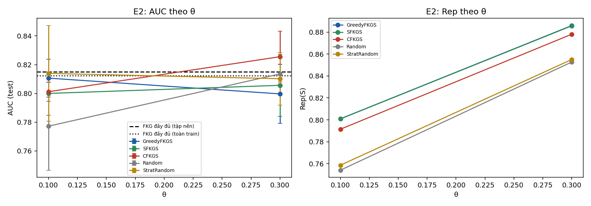
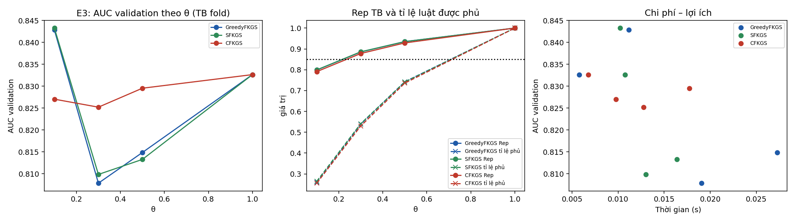
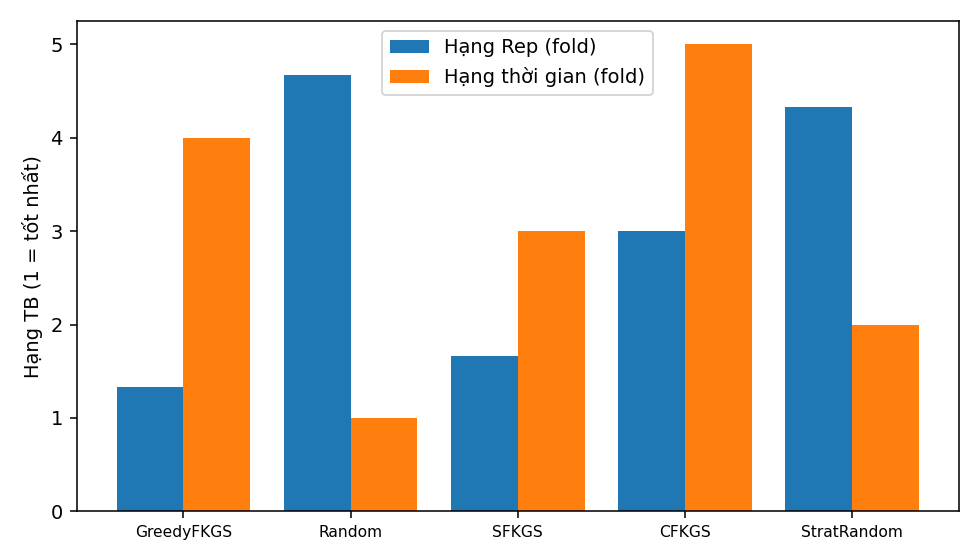

# Báo cáo thực nghiệm FKGS v3 — bộ dữ liệu `heart`

| Mục | Giá trị |
|---|---|
| run_id | `20261001T155422-2b9c1047` |
| Mã nguồn (SHA-256 tổng hợp) | `300a2edd305b68d6…` |
| Dữ liệu | real `data\heart\Data.csv` SHA-256 `948420b084d8a3a0…` |
| Tiền xử lý | 918 dòng → 918 sau loại 0 trùng; nhãn {'0': 410, '1': 508}; X trùng khác nhãn: 0 |
| Chia dữ liệu | 3-fold phân tầng, seed 42; tập nền N_EXP=300 |
| Điền giá trị thiếu | trung vị toàn cục của train (chỉ X), cùng quy tắc train/test |
| Nhân Sim / Rep | 1−Hamming cùng nhãn, −1 khác nhãn; Rep dùng max(0,Sim) |
| Mờ hoá | 3 mức theo phân vị [0.333, 0.667] của tập huấn luyện |
| FISA-P | PAIR_SCOPE=`global`; điểm s = log D1 − log D0; quyết định `calibrated` (tiêu chí `bacc`, tập xác thực 0.2 tập huấn luyện) |
| Ngân sách | `exact` (mọi phương pháp chọn đúng ceil(θn) luật) |
| Môi trường | Python 3.12.1, numpy 1.26.4, scipy 1.13.0, sklearn 1.7.0, Windows-11-10.0.26100-SP0 |
| Chế độ | QUICK (không dùng để báo cáo) |

## E1 — Kiểm chứng cận lý thuyết (RQ1)

12 mẫu con từ luật huấn luyện fold 0 (vét cạn). Cận 1−1/e = 0.6321.

| n | m | m/n thực | Greedy ρ TB / min | SFKGS Rep/OPT_pb min | SFKGS tỉ lệ cục bộ min | SFKGS max\|g\| | CFKGS Rep/OPT_pb min | CFKGS min g |
|---|---|---|---|---|---|---|---|---|
| 10 | 2 | 0.200 | 1.0000 / 1.0000 | 1.0000 | 1.0000 | 1.1e-16 | 1.0323 | 1.8e-02 |
| 10 | 4 | 0.400 | 0.9963 / 0.9889 | 0.9889 | 0.9722 | 0.0e+00 | 1.0633 | 4.5e-02 |
| 12 | 2 | 0.167 | 1.0000 / 1.0000 | 1.0000 | 1.0000 | 1.1e-16 | 1.1739 | 9.1e-02 |
| 12 | 5 | 0.417 | 1.0000 / 1.0000 | 0.9906 | 0.9808 | 0.0e+00 | 1.0000 | 0.0e+00 |

Số vi phạm: greedy=0, sfkgs=0, cfkgs=0, sfkgs_decomposition=0, cfkgs_negative_g=0, chain=0, classdev_sfkgs=0, classdev_cfkgs=0, greedy_above_opt=0, size_mismatch=0

## E2 — So sánh với FKG đầy đủ và lấy mẫu cơ sở, cùng ngân sách (RQ2)

Đơn vị suy luận: fold (n = số fold); Random/StratRandom lấy trung bình theo hạt giống trong fold. Các fold có tập huấn luyện chồng lấp nên p-value mang tính mô tả trong phạm vi bộ dữ liệu.

| Mốc | \|R\| | AUC | Balanced Acc | Accuracy | Acc (argmax) | BalAcc (argmax) |
|---|---|---|---|---|---|---|
| FKG đầy đủ (tập nền) | 300 | 0.8151 ± 0.0146 | 0.7588 | 0.7625 | 0.6667 | 0.6352 |
| FKG đầy đủ (toàn train) | 489 | 0.8122 ± 0.0243 | 0.7565 | 0.7625 | 0.6656 | 0.6342 |

| θ | Phương pháp | \|S\| | Rep | Tỉ lệ luật phủ (≥δ) | AUC | Accuracy | Balanced Acc | Lớp+ trong mẫu | t chọn (s) |
|---|---|---|---|---|---|---|---|---|---|
| 0.1 | GreedyFKGS | 30 | 0.8009 ± 0.0069 | 0.259 | 0.8106 ± 0.0132 | 0.7277 | 0.7294 | 0.544 | 0.007 |
| 0.1 | SFKGS | 30 | 0.8008 ± 0.0062 | 0.262 | 0.8000 ± 0.0151 | 0.7527 | 0.7432 | 0.567 | 0.002 |
| 0.1 | CFKGS | 30 | 0.7914 ± 0.0097 | 0.238 | 0.8012 ± 0.0066 | 0.7451 | 0.7409 | 0.567 | 0.006 |
| 0.1 | Random | 30 | 0.7541 ± 0.0038 | 0.177 | 0.7772 ± 0.0306 | 0.7171 | 0.7127 | 0.593 | 0.000 |
| 0.1 | StratRandom | 30 | 0.7586 ± 0.0090 | 0.183 | 0.8139 ± 0.0333 | 0.7596 | 0.7577 | 0.567 | 0.000 |
| 0.3 | GreedyFKGS | 90 | 0.8860 ± 0.0056 | 0.531 | 0.7997 ± 0.0204 | 0.7386 | 0.7364 | 0.511 | 0.019 |
| 0.3 | SFKGS | 90 | 0.8858 ± 0.0062 | 0.531 | 0.8056 ± 0.0216 | 0.7560 | 0.7545 | 0.556 | 0.005 |
| 0.3 | CFKGS | 90 | 0.8781 ± 0.0049 | 0.520 | 0.8255 ± 0.0177 | 0.7843 | 0.7768 | 0.556 | 0.009 |
| 0.3 | Random | 90 | 0.8527 ± 0.0036 | 0.443 | 0.8136 ± 0.0069 | 0.7556 | 0.7537 | 0.560 | 0.000 |
| 0.3 | StratRandom | 90 | 0.8550 ± 0.0035 | 0.453 | 0.8102 ± 0.0183 | 0.7480 | 0.7430 | 0.556 | 0.000 |

Kiểm định Wilcoxon một phía (phương pháp > đối chứng), đơn vị fold, Holm trong từng họ (độ đo × đối chứng):

| Độ đo | Đối chứng | θ | Phương pháp | Chênh TB | CI95 (t) | Fold tốt hơn | Tỉ lệ seed bị vượt | p | p Holm |
|---|---|---|---|---|---|---|---|---|---|
| rep | Random | 0.1 | GreedyFKGS | +0.0468 | [0.0340; 0.0597] | 3/3 | 1.00 | 0.1250 | 0.7500 |
| rep | Random | 0.1 | SFKGS | +0.0467 | [0.0342; 0.0593] | 3/3 | 1.00 | 0.1250 | 0.7500 |
| rep | Random | 0.1 | CFKGS | +0.0373 | [0.0188; 0.0559] | 3/3 | 1.00 | 0.1250 | 0.7500 |
| rep | Random | 0.3 | GreedyFKGS | +0.0332 | [0.0246; 0.0419] | 3/3 | 1.00 | 0.1250 | 0.7500 |
| rep | Random | 0.3 | SFKGS | +0.0330 | [0.0241; 0.0419] | 3/3 | 1.00 | 0.1250 | 0.7500 |
| rep | Random | 0.3 | CFKGS | +0.0254 | [0.0185; 0.0323] | 3/3 | 1.00 | 0.1250 | 0.7500 |
| rep | StratRandom | 0.1 | GreedyFKGS | +0.0423 | [0.0328; 0.0518] | 3/3 | 1.00 | 0.1250 | 0.7500 |
| rep | StratRandom | 0.1 | SFKGS | +0.0422 | [0.0302; 0.0541] | 3/3 | 1.00 | 0.1250 | 0.7500 |
| rep | StratRandom | 0.1 | CFKGS | +0.0328 | [0.0244; 0.0412] | 3/3 | 1.00 | 0.1250 | 0.7500 |
| rep | StratRandom | 0.3 | GreedyFKGS | +0.0309 | [0.0233; 0.0385] | 3/3 | 1.00 | 0.1250 | 0.7500 |
| rep | StratRandom | 0.3 | SFKGS | +0.0307 | [0.0227; 0.0388] | 3/3 | 1.00 | 0.1250 | 0.7500 |
| rep | StratRandom | 0.3 | CFKGS | +0.0231 | [0.0173; 0.0288] | 3/3 | 1.00 | 0.1250 | 0.7500 |
| auc | Random | 0.1 | GreedyFKGS | +0.0334 | [-0.0463; 0.1131] | 3/3 | 0.56 | 0.1250 | 0.7500 |
| auc | Random | 0.1 | SFKGS | +0.0228 | [-0.0477; 0.0932] | 2/3 | 0.44 | 0.2500 | 1.0000 |
| auc | Random | 0.1 | CFKGS | +0.0240 | [-0.0545; 0.1024] | 2/3 | 0.56 | 0.2500 | 1.0000 |
| auc | Random | 0.3 | GreedyFKGS | -0.0139 | [-0.0686; 0.0408] | 1/3 | 0.22 | 0.8750 | 1.0000 |
| auc | Random | 0.3 | SFKGS | -0.0079 | [-0.0639; 0.0480] | 1/3 | 0.33 | 0.7500 | 1.0000 |
| auc | Random | 0.3 | CFKGS | +0.0120 | [-0.0452; 0.0691] | 2/3 | 0.67 | 0.3750 | 1.0000 |
| auc | StratRandom | 0.1 | GreedyFKGS | -0.0033 | [-0.0787; 0.0721] | 1/3 | 0.33 | 0.6250 | 1.0000 |
| auc | StratRandom | 0.1 | SFKGS | -0.0139 | [-0.0783; 0.0504] | 1/3 | 0.22 | 0.8750 | 1.0000 |
| auc | StratRandom | 0.1 | CFKGS | -0.0127 | [-0.0925; 0.0670] | 1/3 | 0.33 | 0.8750 | 1.0000 |
| auc | StratRandom | 0.3 | GreedyFKGS | -0.0106 | [-0.0273; 0.0062] | 0/3 | 0.33 | 1.0000 | 1.0000 |
| auc | StratRandom | 0.3 | SFKGS | -0.0046 | [-0.0185; 0.0093] | 1/3 | 0.33 | 0.8750 | 1.0000 |
| auc | StratRandom | 0.3 | CFKGS | +0.0153 | [-0.0285; 0.0591] | 2/3 | 0.78 | 0.2500 | 1.0000 |
| auc | FKG_full_pool | 0.1 | GreedyFKGS | -0.0044 | [-0.0381; 0.0292] | 1/3 | — | 0.7500 | 1.0000 |
| auc | FKG_full_pool | 0.1 | SFKGS | -0.0151 | [-0.0408; 0.0107] | 0/3 | — | 1.0000 | 1.0000 |
| auc | FKG_full_pool | 0.1 | CFKGS | -0.0139 | [-0.0472; 0.0195] | 1/3 | — | 0.8750 | 1.0000 |
| auc | FKG_full_pool | 0.3 | GreedyFKGS | -0.0154 | [-0.0310; 0.0002] | 0/3 | — | 1.0000 | 1.0000 |
| auc | FKG_full_pool | 0.3 | SFKGS | -0.0094 | [-0.0268; 0.0080] | 0/3 | — | 1.0000 | 1.0000 |
| auc | FKG_full_pool | 0.3 | CFKGS | +0.0105 | [-0.0229; 0.0439] | 2/3 | — | 0.2500 | 1.0000 |

## E3 — Đường cong theo θ, chọn θ* trên validation (RQ3)

θ* = điểm gối trên mặt Pareto (chi phí = chọn luật + xây FISA + suy diễn; lợi ích = AUC validation). Test chỉ dùng để đánh giá tại θ*. Ngưỡng Rep trung bình = 0.85; phủ toàn phần = mọi luật có cov ≥ 0.85.

| Phương pháp | θ* theo fold | \|S\| TB tại θ* | AUC test tại θ* | Acc / BalAcc test tại θ* | AUC test FKG đầy đủ | Acc / BalAcc FKG đầy đủ | θ nhỏ nhất Rep TB ≥ ngưỡng | θ nhỏ nhất phủ toàn phần |
|---|---|---|---|---|---|---|---|---|
| GreedyFKGS | 0.1, 0.1, 0.1 | 30 | 0.8106 ± 0.0132 | 0.7277 / 0.7294 | 0.8151 | 0.7625 / 0.7588 | 0.3, 0.3, 0.3 | 1.0, 1.0, 1.0 |
| SFKGS | 0.1, 0.1, 0.1 | 30 | 0.8000 ± 0.0151 | 0.7527 / 0.7432 | 0.8151 | 0.7625 / 0.7588 | 0.3, 0.3, 0.3 | 1.0, 1.0, 1.0 |
| CFKGS | 0.3, 0.5, 0.1 | 90 | 0.8193 ± 0.0237 | 0.7636 / 0.7609 | 0.8151 | 0.7625 / 0.7588 | 0.3, 0.3, 0.3 | 1.0, 1.0, 1.0 |

## E4 — So sánh các chiến lược tại θ = 0.2, cùng ngân sách (RQ4)

| Phương pháp | \|S\| | Rep TB ± ĐLC | Tỉ lệ luật phủ | Lớp+ | Thời gian (ms) |
|---|---|---|---|---|---|
| GreedyFKGS | 30 | 0.8230 ± 0.0066 | 0.329 | 0.522 | 2.1 |
| Random | 30 | 0.7807 ± 0.0105 | 0.272 | 0.589 | 0.1 |
| SFKGS | 30 | 0.8227 ± 0.0064 | 0.331 | 0.567 | 1.1 |
| CFKGS | 30 | 0.8147 ± 0.0063 | 0.331 | 0.567 | 4.5 |
| StratRandom | 30 | 0.7810 ± 0.0074 | 0.256 | 0.567 | 0.1 |

**Rep, 5 block = trung bình fold (chính):** Friedman χ²=10.933, p=0.0273, CD=3.522 (3 block). Hạng: GreedyFKGS=1.33, Random=4.67, SFKGS=1.67, CFKGS=3.00, StratRandom=4.33. Cặp khác biệt: không có

**Rep, 50 block (mô tả, có điều kiện trên fold):** Friedman χ²=22.084, p=1.93e-04, CD=2.490 (6 block). Hạng: GreedyFKGS=1.25, Random=4.50, SFKGS=1.75, CFKGS=3.00, StratRandom=4.50. Cặp khác biệt: GreedyFKGS–Random, GreedyFKGS–StratRandom, Random–SFKGS, SFKGS–StratRandom

**Thời gian, trung bình fold:** Friedman χ²=12.000, p=0.0174, CD=3.522 (3 block). Hạng: GreedyFKGS=4.00, Random=1.00, SFKGS=3.00, CFKGS=5.00, StratRandom=2.00. Cặp khác biệt: Random–CFKGS

## PUB — Giao thức của bài công bố: chia cố định 70/30, FKG đầy đủ

Độ chính xác đã công bố của FKG đầy đủ: None. Ngưỡng hiệu chỉnh được chọn trên tập xác thực tách 20% từ tập huấn luyện; tập kiểm tra 30% không tham gia chọn ngưỡng.

| FISA | Mờ hoá | Số seed | AUC | Acc argmax | BalAcc argmax | Acc (D0>9·D1) | Acc hiệu chỉnh (tiêu chí Acc) | BalAcc hiệu chỉnh (tiêu chí BalAcc) | Độ nhạy / Độ đặc hiệu (hiệu chỉnh BalAcc) |
|---|---|---|---|---|---|---|---|---|---|
| gốc (tổ hợp ba) | q10/q90 | 1 | 0.8067 | 0.5652 ± 0.0000 | 0.5122 | 0.5543 | 0.7174 ± 0.0000 | 0.7068 | 0.804 / 0.610 |
| gốc (tổ hợp ba) | tam phân vị | 1 | 0.9184 | 0.8478 ± 0.0000 | 0.8388 | 0.5797 | 0.8514 ± 0.0000 | 0.8477 | 0.882 / 0.813 |
| FISA-P (cặp) | q10/q90 | 1 | 0.8199 | 0.5543 ± 0.0000 | 0.5000 | 0.5543 | 0.7971 ± 0.0000 | 0.6335 | 0.405 / 0.862 |
| FISA-P (cặp) | tam phân vị | 1 | 0.8464 | 0.6920 ± 0.0000 | 0.6593 | 0.5543 | 0.7935 ± 0.0000 | 0.6996 | 0.497 / 0.902 |
