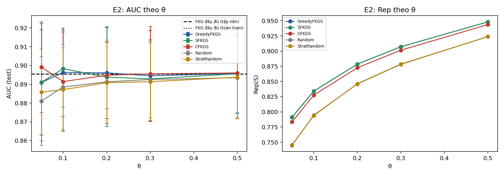
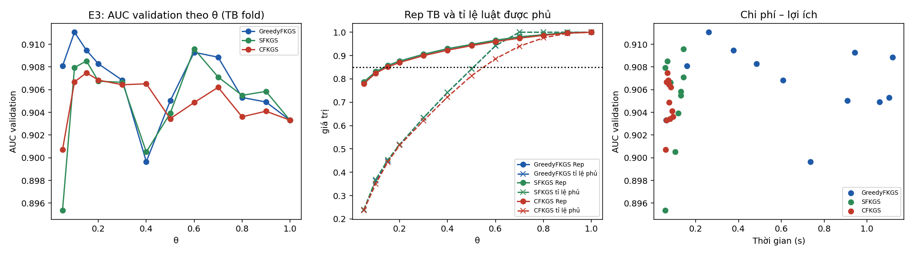
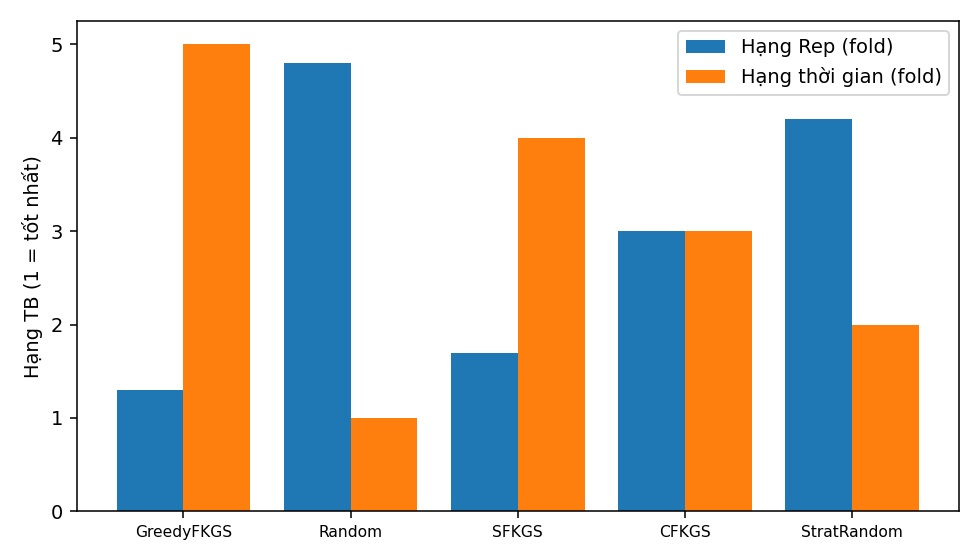

# Báo cáo thực nghiệm FKGS v3 — bộ dữ liệu `heart`

| Mục | Giá trị |
|---|---|
| run_id | `20261003T150534-d32500a6` |
| Mã nguồn (SHA-256 tổng hợp) | `3ac46dee1f5551d8…` |
| Dữ liệu | real `data\heart\Data.csv` SHA-256 `948420b084d8a3a0…` |
| Tiền xử lý | 918 dòng → 918 sau loại 0 trùng; nhãn {'0': 410, '1': 508}; X trùng khác nhãn: 0 |
| Chia dữ liệu | 5-fold phân tầng, seed 42; tập nền N_EXP=1500 |
| Điền giá trị thiếu | trung vị toàn cục của train (chỉ X), cùng quy tắc train/test |
| Nhân Sim / Rep | 1−Hamming cùng nhãn, −1 khác nhãn; Rep dùng max(0,Sim) |
| Mờ hoá | 3 mức theo phân vị [0.333, 0.667] của tập huấn luyện |
| FISA (FKG-Pairs) | k = `3` (gộp C̃ có điều kiện theo nhãn, công thức (10)); điểm s = log D1 − log D0; quyết định `calibrated` (tiêu chí `bacc`, tập xác thực 0.2 tập huấn luyện) |
| Ngân sách | `exact` (mọi phương pháp chọn đúng ceil(θn) luật) |
| Môi trường | Python 3.11.5, numpy 2.2.2, scipy 1.15.1, sklearn 1.6.1, Windows-10-10.0.19045-SP0 |
| Chế độ | đầy đủ |

## E1 — Kiểm chứng cận lý thuyết (RQ1)

120 mẫu con từ luật huấn luyện fold 0 (vét cạn). Cận 1−1/e = 0.6321.

| n | m | m/n thực | Greedy ρ TB / min | SFKGS Rep/OPT_pb min | SFKGS tỉ lệ cục bộ min | SFKGS max\|g\| | CFKGS Rep/OPT_pb min | CFKGS min g |
|---|---|---|---|---|---|---|---|---|
| 10 | 2 | 0.200 | 1.0000 / 1.0000 | 0.9687 | 0.9688 | 2.2e-16 | 1.0000 | 1.1e-16 |
| 10 | 4 | 0.400 | 0.9959 / 0.9762 | 0.9762 | 0.9677 | 2.2e-16 | 1.0000 | 0.0e+00 |
| 14 | 3 | 0.214 | 0.9966 / 0.9717 | 0.9717 | 0.9559 | 2.2e-16 | 1.0388 | 2.6e-02 |
| 14 | 6 | 0.429 | 0.9976 / 0.9917 | 0.9917 | 0.9815 | 2.2e-16 | 0.9916 | 0.0e+00 |
| 18 | 4 | 0.222 | 0.9968 / 0.9790 | 0.9856 | 0.9804 | 1.1e-16 | 1.0000 | 1.1e-16 |
| 18 | 7 | 0.389 | 0.9969 / 0.9760 | 0.9811 | 0.9811 | 2.2e-16 | 0.9936 | 1.1e-16 |

Số vi phạm: greedy=0, sfkgs=0, cfkgs=0, sfkgs_decomposition=0, cfkgs_negative_g=0, chain=0, classdev_sfkgs=0, classdev_cfkgs=0, greedy_above_opt=0, size_mismatch=0

## E2 — So sánh với FKG đầy đủ và lấy mẫu cơ sở, cùng ngân sách (RQ2)

Đơn vị suy luận: fold (n = số fold); Random/StratRandom lấy trung bình theo hạt giống trong fold. Các fold có tập huấn luyện chồng lấp nên p-value mang tính mô tả trong phạm vi bộ dữ liệu.

| Mốc | \|R\| | AUC | Balanced Acc | Accuracy | Acc (argmax) | BalAcc (argmax) |
|---|---|---|---|---|---|---|
| FKG đầy đủ (tập nền) | 587 | 0.8956 ± 0.0232 | 0.8300 | 0.8323 | 0.8398 | 0.8328 |
| FKG đầy đủ (toàn train) | 587 | 0.8956 ± 0.0232 | 0.8300 | 0.8323 | 0.8398 | 0.8328 |

| θ | Phương pháp | \|S\| | Rep | Tỉ lệ luật phủ (≥δ) | AUC | Accuracy | Balanced Acc | Lớp+ trong mẫu | t chọn (s) |
|---|---|---|---|---|---|---|---|---|---|
| 0.05 | GreedyFKGS | 30 | 0.7912 ± 0.0016 | 0.246 | 0.8909 ± 0.0280 | 0.8290 | 0.8293 | 0.540 | 0.123 |
| 0.05 | SFKGS | 30 | 0.7909 ± 0.0016 | 0.242 | 0.8911 ± 0.0313 | 0.8464 | 0.8443 | 0.567 | 0.010 |
| 0.05 | CFKGS | 30 | 0.7833 ± 0.0019 | 0.236 | 0.8991 ± 0.0241 | 0.8486 | 0.8465 | 0.567 | 0.018 |
| 0.05 | Random | 30 | 0.7447 ± 0.0012 | 0.142 | 0.8811 ± 0.0236 | 0.8198 | 0.8173 | 0.551 | 0.000 |
| 0.05 | StratRandom | 30 | 0.7455 ± 0.0011 | 0.138 | 0.8857 ± 0.0230 | 0.8238 | 0.8211 | 0.567 | 0.000 |
| 0.1 | GreedyFKGS | 59 | 0.8341 ± 0.0011 | 0.364 | 0.8963 ± 0.0236 | 0.8540 | 0.8498 | 0.536 | 0.214 |
| 0.1 | SFKGS | 59 | 0.8339 ± 0.0013 | 0.363 | 0.8983 ± 0.0205 | 0.8421 | 0.8393 | 0.559 | 0.017 |
| 0.1 | CFKGS | 59 | 0.8276 ± 0.0019 | 0.359 | 0.8914 ± 0.0263 | 0.8235 | 0.8201 | 0.559 | 0.018 |
| 0.1 | Random | 59 | 0.7946 ± 0.0010 | 0.250 | 0.8885 ± 0.0228 | 0.8271 | 0.8255 | 0.554 | 0.000 |
| 0.1 | StratRandom | 59 | 0.7938 ± 0.0008 | 0.246 | 0.8871 ± 0.0222 | 0.8286 | 0.8261 | 0.559 | 0.000 |
| 0.2 | GreedyFKGS | 118 | 0.8785 ± 0.0005 | 0.523 | 0.8961 ± 0.0244 | 0.8442 | 0.8410 | 0.547 | 0.504 |
| 0.2 | SFKGS | 118 | 0.8786 ± 0.0006 | 0.525 | 0.8938 ± 0.0264 | 0.8431 | 0.8411 | 0.551 | 0.036 |
| 0.2 | CFKGS | 118 | 0.8726 ± 0.0009 | 0.524 | 0.8948 ± 0.0177 | 0.8399 | 0.8373 | 0.551 | 0.039 |
| 0.2 | Random | 118 | 0.8458 ± 0.0007 | 0.416 | 0.8913 ± 0.0222 | 0.8350 | 0.8325 | 0.554 | 0.000 |
| 0.2 | StratRandom | 118 | 0.8463 ± 0.0005 | 0.418 | 0.8909 ± 0.0214 | 0.8340 | 0.8322 | 0.551 | 0.000 |
| 0.3 | GreedyFKGS | 177 | 0.9071 ± 0.0005 | 0.638 | 0.8945 ± 0.0240 | 0.8421 | 0.8421 | 0.527 | 0.589 |
| 0.3 | SFKGS | 177 | 0.9072 ± 0.0004 | 0.640 | 0.8929 ± 0.0208 | 0.8475 | 0.8463 | 0.554 | 0.044 |
| 0.3 | CFKGS | 177 | 0.9015 ± 0.0007 | 0.634 | 0.8956 ± 0.0253 | 0.8431 | 0.8395 | 0.554 | 0.022 |
| 0.3 | Random | 177 | 0.8781 ± 0.0009 | 0.540 | 0.8925 ± 0.0204 | 0.8386 | 0.8360 | 0.552 | 0.000 |
| 0.3 | StratRandom | 177 | 0.8786 ± 0.0009 | 0.543 | 0.8914 ± 0.0207 | 0.8381 | 0.8360 | 0.554 | 0.000 |
| 0.5 | GreedyFKGS | 294 | 0.9482 ± 0.0008 | 0.850 | 0.8957 ± 0.0209 | 0.8377 | 0.8337 | 0.546 | 0.878 |
| 0.5 | SFKGS | 294 | 0.9482 ± 0.0009 | 0.851 | 0.8956 ± 0.0212 | 0.8410 | 0.8369 | 0.554 | 0.068 |
| 0.5 | CFKGS | 294 | 0.9437 ± 0.0006 | 0.825 | 0.8961 ± 0.0240 | 0.8312 | 0.8306 | 0.554 | 0.027 |
| 0.5 | Random | 294 | 0.9239 ± 0.0004 | 0.722 | 0.8935 ± 0.0219 | 0.8364 | 0.8344 | 0.554 | 0.000 |
| 0.5 | StratRandom | 294 | 0.9239 ± 0.0003 | 0.723 | 0.8938 ± 0.0221 | 0.8351 | 0.8330 | 0.554 | 0.000 |

Kiểm định Wilcoxon một phía (phương pháp > đối chứng), đơn vị fold, Holm trong từng họ (độ đo × đối chứng):

| Độ đo | Đối chứng | θ | Phương pháp | Chênh TB | CI95 (t) | Fold tốt hơn | Tỉ lệ seed bị vượt | p | p Holm |
|---|---|---|---|---|---|---|---|---|---|
| rep | Random | 0.05 | GreedyFKGS | +0.0465 | [0.0449; 0.0480] | 5/5 | 1.00 | 0.0312 | 0.4688 |
| rep | Random | 0.05 | SFKGS | +0.0462 | [0.0446; 0.0478] | 5/5 | 1.00 | 0.0312 | 0.4688 |
| rep | Random | 0.05 | CFKGS | +0.0386 | [0.0371; 0.0401] | 5/5 | 1.00 | 0.0312 | 0.4688 |
| rep | Random | 0.1 | GreedyFKGS | +0.0395 | [0.0381; 0.0409] | 5/5 | 1.00 | 0.0312 | 0.4688 |
| rep | Random | 0.1 | SFKGS | +0.0393 | [0.0376; 0.0411] | 5/5 | 1.00 | 0.0312 | 0.4688 |
| rep | Random | 0.1 | CFKGS | +0.0329 | [0.0307; 0.0352] | 5/5 | 1.00 | 0.0312 | 0.4688 |
| rep | Random | 0.2 | GreedyFKGS | +0.0327 | [0.0316; 0.0337] | 5/5 | 1.00 | 0.0312 | 0.4688 |
| rep | Random | 0.2 | SFKGS | +0.0327 | [0.0314; 0.0340] | 5/5 | 1.00 | 0.0312 | 0.4688 |
| rep | Random | 0.2 | CFKGS | +0.0267 | [0.0256; 0.0279] | 5/5 | 1.00 | 0.0312 | 0.4688 |
| rep | Random | 0.3 | GreedyFKGS | +0.0289 | [0.0277; 0.0302] | 5/5 | 1.00 | 0.0312 | 0.4688 |
| rep | Random | 0.3 | SFKGS | +0.0290 | [0.0276; 0.0305] | 5/5 | 1.00 | 0.0312 | 0.4688 |
| rep | Random | 0.3 | CFKGS | +0.0233 | [0.0217; 0.0250] | 5/5 | 1.00 | 0.0312 | 0.4688 |
| rep | Random | 0.5 | GreedyFKGS | +0.0243 | [0.0230; 0.0256] | 5/5 | 1.00 | 0.0312 | 0.4688 |
| rep | Random | 0.5 | SFKGS | +0.0243 | [0.0228; 0.0258] | 5/5 | 1.00 | 0.0312 | 0.4688 |
| rep | Random | 0.5 | CFKGS | +0.0199 | [0.0189; 0.0208] | 5/5 | 1.00 | 0.0312 | 0.4688 |
| rep | StratRandom | 0.05 | GreedyFKGS | +0.0457 | [0.0447; 0.0467] | 5/5 | 1.00 | 0.0312 | 0.4688 |
| rep | StratRandom | 0.05 | SFKGS | +0.0454 | [0.0444; 0.0464] | 5/5 | 1.00 | 0.0312 | 0.4688 |
| rep | StratRandom | 0.05 | CFKGS | +0.0378 | [0.0358; 0.0398] | 5/5 | 1.00 | 0.0312 | 0.4688 |
| rep | StratRandom | 0.1 | GreedyFKGS | +0.0403 | [0.0394; 0.0413] | 5/5 | 1.00 | 0.0312 | 0.4688 |
| rep | StratRandom | 0.1 | SFKGS | +0.0401 | [0.0387; 0.0415] | 5/5 | 1.00 | 0.0312 | 0.4688 |
| rep | StratRandom | 0.1 | CFKGS | +0.0338 | [0.0319; 0.0356] | 5/5 | 1.00 | 0.0312 | 0.4688 |
| rep | StratRandom | 0.2 | GreedyFKGS | +0.0322 | [0.0312; 0.0332] | 5/5 | 1.00 | 0.0312 | 0.4688 |
| rep | StratRandom | 0.2 | SFKGS | +0.0323 | [0.0311; 0.0335] | 5/5 | 1.00 | 0.0312 | 0.4688 |
| rep | StratRandom | 0.2 | CFKGS | +0.0263 | [0.0251; 0.0275] | 5/5 | 1.00 | 0.0312 | 0.4688 |
| rep | StratRandom | 0.3 | GreedyFKGS | +0.0284 | [0.0271; 0.0298] | 5/5 | 1.00 | 0.0312 | 0.4688 |
| rep | StratRandom | 0.3 | SFKGS | +0.0285 | [0.0273; 0.0298] | 5/5 | 1.00 | 0.0312 | 0.4688 |
| rep | StratRandom | 0.3 | CFKGS | +0.0228 | [0.0220; 0.0237] | 5/5 | 1.00 | 0.0312 | 0.4688 |
| rep | StratRandom | 0.5 | GreedyFKGS | +0.0242 | [0.0232; 0.0253] | 5/5 | 1.00 | 0.0312 | 0.4688 |
| rep | StratRandom | 0.5 | SFKGS | +0.0243 | [0.0231; 0.0255] | 5/5 | 1.00 | 0.0312 | 0.4688 |
| rep | StratRandom | 0.5 | CFKGS | +0.0198 | [0.0188; 0.0208] | 5/5 | 1.00 | 0.0312 | 0.4688 |
| auc | Random | 0.05 | GreedyFKGS | +0.0099 | [-0.0116; 0.0314] | 3/5 | 0.67 | 0.2188 | 1.0000 |
| auc | Random | 0.05 | SFKGS | +0.0100 | [-0.0164; 0.0365] | 3/5 | 0.69 | 0.2188 | 1.0000 |
| auc | Random | 0.05 | CFKGS | +0.0181 | [0.0043; 0.0318] | 5/5 | 0.79 | 0.0312 | 0.4688 |
| auc | Random | 0.1 | GreedyFKGS | +0.0078 | [-0.0126; 0.0283] | 2/5 | 0.59 | 0.4062 | 1.0000 |
| auc | Random | 0.1 | SFKGS | +0.0098 | [-0.0056; 0.0252] | 4/5 | 0.65 | 0.0938 | 1.0000 |
| auc | Random | 0.1 | CFKGS | +0.0029 | [-0.0116; 0.0174] | 3/5 | 0.56 | 0.3125 | 1.0000 |
| auc | Random | 0.2 | GreedyFKGS | +0.0048 | [-0.0061; 0.0156] | 3/5 | 0.63 | 0.2188 | 1.0000 |
| auc | Random | 0.2 | SFKGS | +0.0025 | [-0.0102; 0.0151] | 3/5 | 0.55 | 0.3125 | 1.0000 |
| auc | Random | 0.2 | CFKGS | +0.0035 | [-0.0032; 0.0101] | 4/5 | 0.63 | 0.0625 | 0.8750 |
| auc | Random | 0.3 | GreedyFKGS | +0.0020 | [-0.0060; 0.0100] | 4/5 | 0.57 | 0.2188 | 1.0000 |
| auc | Random | 0.3 | SFKGS | +0.0003 | [-0.0065; 0.0072] | 2/5 | 0.46 | 0.5938 | 1.0000 |
| auc | Random | 0.3 | CFKGS | +0.0030 | [-0.0050; 0.0111] | 4/5 | 0.63 | 0.2188 | 1.0000 |
| auc | Random | 0.5 | GreedyFKGS | +0.0022 | [-0.0034; 0.0078] | 3/5 | 0.59 | 0.2188 | 1.0000 |
| auc | Random | 0.5 | SFKGS | +0.0021 | [-0.0024; 0.0066] | 3/5 | 0.59 | 0.2188 | 1.0000 |
| auc | Random | 0.5 | CFKGS | +0.0026 | [-0.0031; 0.0082] | 3/5 | 0.59 | 0.1562 | 1.0000 |
| auc | StratRandom | 0.05 | GreedyFKGS | +0.0052 | [-0.0182; 0.0286] | 3/5 | 0.59 | 0.3125 | 1.0000 |
| auc | StratRandom | 0.05 | SFKGS | +0.0054 | [-0.0228; 0.0335] | 3/5 | 0.57 | 0.3125 | 1.0000 |
| auc | StratRandom | 0.05 | CFKGS | +0.0134 | [-0.0036; 0.0304] | 4/5 | 0.71 | 0.0938 | 1.0000 |
| auc | StratRandom | 0.1 | GreedyFKGS | +0.0092 | [-0.0118; 0.0302] | 2/5 | 0.61 | 0.4062 | 1.0000 |
| auc | StratRandom | 0.1 | SFKGS | +0.0112 | [-0.0042; 0.0266] | 4/5 | 0.71 | 0.0625 | 0.9375 |
| auc | StratRandom | 0.1 | CFKGS | +0.0043 | [-0.0098; 0.0184] | 4/5 | 0.60 | 0.2188 | 1.0000 |
| auc | StratRandom | 0.2 | GreedyFKGS | +0.0052 | [-0.0063; 0.0168] | 3/5 | 0.58 | 0.1562 | 1.0000 |
| auc | StratRandom | 0.2 | SFKGS | +0.0029 | [-0.0104; 0.0163] | 3/5 | 0.54 | 0.3125 | 1.0000 |
| auc | StratRandom | 0.2 | CFKGS | +0.0039 | [-0.0020; 0.0099] | 4/5 | 0.55 | 0.0938 | 1.0000 |
| auc | StratRandom | 0.3 | GreedyFKGS | +0.0032 | [-0.0036; 0.0100] | 4/5 | 0.63 | 0.1562 | 1.0000 |
| auc | StratRandom | 0.3 | SFKGS | +0.0015 | [-0.0046; 0.0076] | 3/5 | 0.54 | 0.3125 | 1.0000 |
| auc | StratRandom | 0.3 | CFKGS | +0.0042 | [-0.0031; 0.0115] | 4/5 | 0.68 | 0.0938 | 1.0000 |
| auc | StratRandom | 0.5 | GreedyFKGS | +0.0020 | [-0.0040; 0.0080] | 3/5 | 0.57 | 0.3125 | 1.0000 |
| auc | StratRandom | 0.5 | SFKGS | +0.0018 | [-0.0031; 0.0068] | 3/5 | 0.60 | 0.3125 | 1.0000 |
| auc | StratRandom | 0.5 | CFKGS | +0.0023 | [-0.0035; 0.0080] | 3/5 | 0.62 | 0.3125 | 1.0000 |
| auc | FKG_full_pool | 0.05 | GreedyFKGS | -0.0046 | [-0.0183; 0.0091] | 2/5 | — | 0.7812 | 1.0000 |
| auc | FKG_full_pool | 0.05 | SFKGS | -0.0044 | [-0.0236; 0.0147] | 2/5 | — | 0.6875 | 1.0000 |
| auc | FKG_full_pool | 0.05 | CFKGS | +0.0036 | [-0.0043; 0.0114] | 4/5 | — | 0.1562 | 1.0000 |
| auc | FKG_full_pool | 0.1 | GreedyFKGS | +0.0008 | [-0.0111; 0.0126] | 2/5 | — | 0.4062 | 1.0000 |
| auc | FKG_full_pool | 0.1 | SFKGS | +0.0028 | [-0.0064; 0.0119] | 4/5 | — | 0.2188 | 1.0000 |
| auc | FKG_full_pool | 0.1 | CFKGS | -0.0041 | [-0.0154; 0.0072] | 2/5 | — | 0.8438 | 1.0000 |
| auc | FKG_full_pool | 0.2 | GreedyFKGS | +0.0005 | [-0.0045; 0.0056] | 3/5 | — | 0.5000 | 1.0000 |
| auc | FKG_full_pool | 0.2 | SFKGS | -0.0018 | [-0.0086; 0.0051] | 3/5 | — | 0.6875 | 1.0000 |
| auc | FKG_full_pool | 0.2 | CFKGS | -0.0008 | [-0.0118; 0.0103] | 1/5 | — | 0.7812 | 1.0000 |
| auc | FKG_full_pool | 0.3 | GreedyFKGS | -0.0010 | [-0.0060; 0.0040] | 2/5 | — | 0.7812 | 1.0000 |
| auc | FKG_full_pool | 0.3 | SFKGS | -0.0027 | [-0.0073; 0.0019] | 1/5 | — | 0.9375 | 1.0000 |
| auc | FKG_full_pool | 0.3 | CFKGS | +0.0000 | [-0.0052; 0.0052] | 2/5 | — | 0.6875 | 1.0000 |
| auc | FKG_full_pool | 0.5 | GreedyFKGS | +0.0002 | [-0.0056; 0.0059] | 3/5 | — | 0.5000 | 1.0000 |
| auc | FKG_full_pool | 0.5 | SFKGS | +0.0000 | [-0.0049; 0.0049] | 3/5 | — | 0.5938 | 1.0000 |
| auc | FKG_full_pool | 0.5 | CFKGS | +0.0005 | [-0.0051; 0.0061] | 2/5 | — | 0.5625 | 1.0000 |

## E3 — Đường cong theo θ, chọn θ* trên validation (RQ3)

θ* = điểm gối trên mặt Pareto (chi phí = chọn luật + xây FISA + suy diễn; lợi ích = AUC validation). Test chỉ dùng để đánh giá tại θ*. Ngưỡng Rep trung bình = 0.85; phủ toàn phần = mọi luật có cov ≥ 0.85.

| Phương pháp | θ* theo fold | \|S\| TB tại θ* | AUC test tại θ* | Acc / BalAcc test tại θ* | AUC test FKG đầy đủ | Acc / BalAcc FKG đầy đủ | θ nhỏ nhất Rep TB ≥ ngưỡng | θ nhỏ nhất phủ toàn phần |
|---|---|---|---|---|---|---|---|---|
| GreedyFKGS | 0.05, 0.05, 0.05, 0.15, 0.1 | 48 | 0.8922 ± 0.0225 | 0.8334 / 0.8324 | 0.8956 | 0.8323 / 0.8300 | 0.15, 0.15, 0.15, 0.15, 0.15 | 0.7, 0.7, 0.7, 0.7, 0.7 |
| SFKGS | 0.2, 0.05, 0.5, 0.3, 0.1 | 136 | 0.8957 ± 0.0205 | 0.8464 / 0.8432 | 0.8956 | 0.8323 / 0.8300 | 0.15, 0.15, 0.15, 0.15, 0.15 | 0.7, 0.7, 0.7, 0.7, 0.7 |
| CFKGS | 0.15, 0.15, 0.05, 1.0, 0.1 | 171 | 0.8954 ± 0.0278 | 0.8278 / 0.8271 | 0.8956 | 0.8323 / 0.8300 | 0.2, 0.15, 0.15, 0.15, 0.15 | 1.0, 1.0, 1.0, 1.0, 1.0 |

## E4 — So sánh các chiến lược tại θ = 0.2, cùng ngân sách (RQ4)

| Phương pháp | \|S\| | Rep TB ± ĐLC | Tỉ lệ luật phủ | Lớp+ | Thời gian (ms) |
|---|---|---|---|---|---|
| GreedyFKGS | 100 | 0.8727 ± 0.0020 | 0.496 | 0.542 | 274.4 |
| Random | 100 | 0.8397 ± 0.0036 | 0.396 | 0.559 | 0.1 |
| SFKGS | 100 | 0.8726 ± 0.0020 | 0.497 | 0.550 | 21.7 |
| CFKGS | 100 | 0.8669 ± 0.0021 | 0.496 | 0.550 | 15.8 |
| StratRandom | 100 | 0.8400 ± 0.0038 | 0.398 | 0.550 | 0.2 |

**Rep, 5 block = trung bình fold (chính):** Friedman χ²=18.707, p=8.97e-04, CD=2.728 (5 block). Hạng: GreedyFKGS=1.30, Random=4.80, SFKGS=1.70, CFKGS=3.00, StratRandom=4.20. Cặp khác biệt: GreedyFKGS–Random, GreedyFKGS–StratRandom, Random–SFKGS

**Rep, 50 block (mô tả, có điều kiện trên fold):** Friedman χ²=183.588, p=1.26e-38, CD=0.863 (50 block). Hạng: GreedyFKGS=1.46, Random=4.53, SFKGS=1.54, CFKGS=3.00, StratRandom=4.47. Cặp khác biệt: GreedyFKGS–Random, GreedyFKGS–CFKGS, GreedyFKGS–StratRandom, Random–SFKGS, Random–CFKGS, SFKGS–CFKGS, SFKGS–StratRandom, CFKGS–StratRandom

**Thời gian, trung bình fold:** Friedman χ²=20.000, p=4.99e-04, CD=2.728 (5 block). Hạng: GreedyFKGS=5.00, Random=1.00, SFKGS=4.00, CFKGS=3.00, StratRandom=2.00. Cặp khác biệt: GreedyFKGS–Random, GreedyFKGS–StratRandom, Random–SFKGS

## PUB — Giao thức của bài công bố: chia cố định 70/30, FKG đầy đủ

Độ chính xác đã công bố của FKG đầy đủ: None. Ngưỡng hiệu chỉnh được chọn trên tập xác thực tách 20% từ tập huấn luyện; tập kiểm tra 30% không tham gia chọn ngưỡng.

| FISA | Mờ hoá | Số seed | AUC | Acc argmax | BalAcc argmax | Acc (D0>9·D1) | Acc hiệu chỉnh (tiêu chí Acc) | BalAcc hiệu chỉnh (tiêu chí BalAcc) | Độ nhạy / Độ đặc hiệu (hiệu chỉnh BalAcc) |
|---|---|---|---|---|---|---|---|---|---|
| FKG-Pairs k=3 | q10/q90 | 1 | 0.8067 | 0.5652 ± 0.0000 | 0.5122 | 0.5543 | 0.7174 ± 0.0000 | 0.7068 | 0.804 / 0.610 |
| FKG-Pairs k=3 | tam phân vị | 5 | 0.8980 | 0.8304 ± 0.0197 | 0.8214 | 0.5775 | 0.8304 ± 0.0141 | 0.8298 | 0.876 / 0.784 |
| Notebook gốc (k=3, nguyên trạng) | tam phân vị | 5 | 0.8980 | 0.8304 ± 0.0197 | 0.8214 | 0.5775 | 0.8304 ± 0.0141 | 0.8298 | 0.876 / 0.784 |
| FKG-Pairs k=1 | tam phân vị | 5 | 0.8523 | 0.6623 ± 0.0228 | 0.6216 | 0.5543 | 0.7725 ± 0.0231 | 0.7755 | 0.748 / 0.803 |
