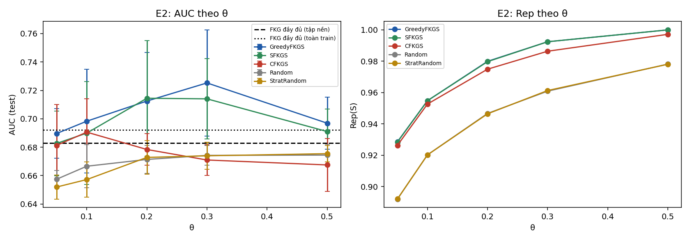
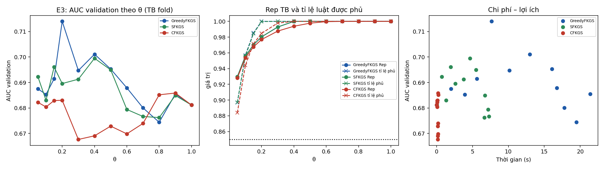
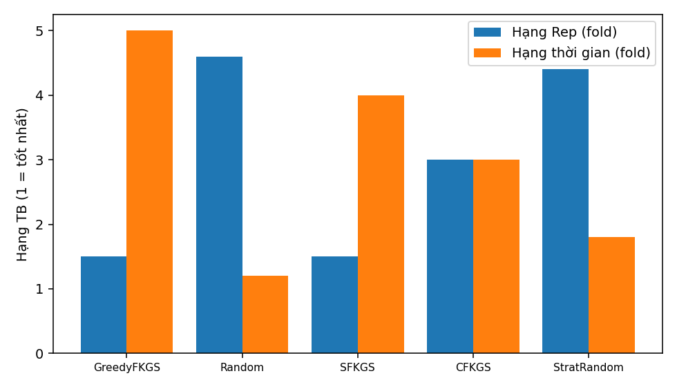

# Báo cáo thực nghiệm FKGS v3 — bộ dữ liệu `diabetes`

| Mục | Giá trị |
|---|---|
| run_id | `20260929T213738-89503e69` |
| Mã nguồn (SHA-256 tổng hợp) | `8bfe68eff198365d…` |
| Dữ liệu | real `data\diabetes\Data.csv` SHA-256 `5236d580bcdeef7e…` |
| Tiền xử lý | 18536 dòng → 15778 sau loại 2758 trùng; nhãn {'0': 10506, '1': 5272}; X trùng khác nhãn: 0 |
| Chia dữ liệu | 5-fold phân tầng, seed 42; tập nền N_EXP=1500 |
| Điền giá trị thiếu | trung vị toàn cục của train (chỉ X), cùng quy tắc train/test |
| Nhân Sim / Rep | 1−Hamming cùng nhãn, −1 khác nhãn; Rep dùng max(0,Sim) |
| FISA | PAIR_SCOPE=`global`, điểm AUC = D1−D0 |
| Ngân sách | `exact` (mọi phương pháp chọn đúng ceil(θn) luật) |
| Môi trường | Python 3.12.1, numpy 1.26.4, scipy 1.13.0, sklearn 1.7.0, Windows-11-10.0.26100-SP0 |
| Chế độ | đầy đủ |

## E1 — Kiểm chứng cận lý thuyết (RQ1)

120 mẫu con từ luật huấn luyện fold 0 (vét cạn). Cận 1−1/e = 0.6321.

| n | m | m/n thực | Greedy ρ TB / min | SFKGS Rep/OPT_pb min | SFKGS tỉ lệ cục bộ min | SFKGS max\|g\| | CFKGS Rep/OPT_pb min | CFKGS min g |
|---|---|---|---|---|---|---|---|---|
| 10 | 2 | 0.200 | 1.0000 / 1.0000 | 1.0000 | 1.0000 | 1.1e-16 | 1.0000 | -1.1e-16 |
| 10 | 4 | 0.400 | 1.0000 / 1.0000 | 0.9853 | 0.9762 | 1.1e-16 | 1.0000 | -1.1e-16 |
| 14 | 3 | 0.214 | 0.9978 / 0.9778 | 0.9778 | 0.9661 | 1.1e-16 | 1.0000 | 0.0e+00 |
| 14 | 6 | 0.429 | 0.9965 / 0.9800 | 0.9804 | 0.9701 | 1.1e-16 | 0.9896 | 0.0e+00 |
| 18 | 4 | 0.222 | 0.9975 / 0.9821 | 0.9821 | 0.9643 | 1.1e-16 | 1.0182 | 1.4e-02 |
| 18 | 7 | 0.389 | 0.9988 / 0.9918 | 0.9918 | 0.9885 | 1.1e-16 | 1.0000 | 0.0e+00 |

Số vi phạm: greedy=0, sfkgs=0, cfkgs=0, sfkgs_decomposition=0, cfkgs_negative_g=0, chain=0, classdev_sfkgs=0, classdev_cfkgs=0, greedy_above_opt=0, size_mismatch=0

## E2 — So sánh với FKG đầy đủ và lấy mẫu cơ sở, cùng ngân sách (RQ2)

Đơn vị suy luận: fold (n = số fold); Random/StratRandom lấy trung bình theo hạt giống trong fold. Các fold có tập huấn luyện chồng lấp nên p-value mang tính mô tả trong phạm vi bộ dữ liệu.

| Mốc | \|R\| | AUC | Balanced Acc | Accuracy |
|---|---|---|---|---|
| FKG đầy đủ (tập nền) | 1500 | 0.6830 ± 0.0139 | 0.5000 | 0.6659 |
| FKG đầy đủ (toàn train) | 12622 | 0.6920 ± 0.0099 | 0.5000 | 0.6659 |

| θ | Phương pháp | \|S\| | Rep | Tỉ lệ luật phủ (≥δ) | AUC | Balanced Acc | Lớp+ trong mẫu | t chọn (s) |
|---|---|---|---|---|---|---|---|---|
| 0.05 | GreedyFKGS | 75 | 0.9286 ± 0.0027 | 0.891 | 0.6897 ± 0.0174 | 0.5000 | 0.360 | 2.009 |
| 0.05 | SFKGS | 75 | 0.9284 ± 0.0025 | 0.890 | 0.6827 ± 0.0229 | 0.5000 | 0.333 | 0.679 |
| 0.05 | CFKGS | 75 | 0.9263 ± 0.0026 | 0.877 | 0.6813 ± 0.0288 | 0.5000 | 0.333 | 0.045 |
| 0.05 | Random | 75 | 0.8920 ± 0.0028 | 0.795 | 0.6575 ± 0.0060 | 0.5000 | 0.340 | 0.000 |
| 0.05 | StratRandom | 75 | 0.8921 ± 0.0018 | 0.797 | 0.6520 ± 0.0085 | 0.5000 | 0.333 | 0.000 |
| 0.1 | GreedyFKGS | 150 | 0.9548 ± 0.0022 | 0.951 | 0.6983 ± 0.0365 | 0.5000 | 0.360 | 3.894 |
| 0.1 | SFKGS | 150 | 0.9548 ± 0.0022 | 0.952 | 0.6899 ± 0.0362 | 0.5000 | 0.333 | 1.330 |
| 0.1 | CFKGS | 150 | 0.9526 ± 0.0023 | 0.939 | 0.6906 ± 0.0236 | 0.5000 | 0.333 | 0.063 |
| 0.1 | Random | 150 | 0.9202 ± 0.0020 | 0.876 | 0.6666 ± 0.0151 | 0.5000 | 0.333 | 0.000 |
| 0.1 | StratRandom | 150 | 0.9202 ± 0.0019 | 0.877 | 0.6572 ± 0.0124 | 0.5000 | 0.333 | 0.000 |
| 0.2 | GreedyFKGS | 300 | 0.9799 ± 0.0012 | 1.000 | 0.7125 ± 0.0343 | 0.5000 | 0.364 | 7.279 |
| 0.2 | SFKGS | 300 | 0.9797 ± 0.0012 | 0.999 | 0.7145 ± 0.0406 | 0.5000 | 0.333 | 2.317 |
| 0.2 | CFKGS | 300 | 0.9749 ± 0.0020 | 0.981 | 0.6784 ± 0.0111 | 0.5000 | 0.333 | 0.095 |
| 0.2 | Random | 300 | 0.9467 ± 0.0017 | 0.934 | 0.6714 ± 0.0098 | 0.5000 | 0.336 | 0.000 |
| 0.2 | StratRandom | 300 | 0.9464 ± 0.0016 | 0.934 | 0.6728 ± 0.0119 | 0.5000 | 0.333 | 0.000 |
| 0.3 | GreedyFKGS | 450 | 0.9924 ± 0.0012 | 1.000 | 0.7252 ± 0.0373 | 0.5000 | 0.368 | 8.938 |
| 0.3 | SFKGS | 450 | 0.9924 ± 0.0012 | 1.000 | 0.7140 ± 0.0283 | 0.5000 | 0.333 | 3.081 |
| 0.3 | CFKGS | 450 | 0.9864 ± 0.0017 | 0.997 | 0.6710 ± 0.0107 | 0.5000 | 0.333 | 0.112 |
| 0.3 | Random | 450 | 0.9609 ± 0.0014 | 0.958 | 0.6742 ± 0.0069 | 0.5000 | 0.335 | 0.000 |
| 0.3 | StratRandom | 450 | 0.9613 ± 0.0013 | 0.959 | 0.6739 ± 0.0095 | 0.5000 | 0.333 | 0.000 |
| 0.5 | GreedyFKGS | 750 | 1.0000 ± 0.0000 | 1.000 | 0.6969 ± 0.0184 | 0.5000 | 0.353 | 14.139 |
| 0.5 | SFKGS | 750 | 1.0000 ± 0.0000 | 1.000 | 0.6910 ± 0.0159 | 0.5000 | 0.333 | 4.586 |
| 0.5 | CFKGS | 750 | 0.9972 ± 0.0004 | 1.000 | 0.6675 ± 0.0187 | 0.5000 | 0.333 | 0.158 |
| 0.5 | Random | 750 | 0.9782 ± 0.0007 | 0.981 | 0.6745 ± 0.0076 | 0.5000 | 0.335 | 0.000 |
| 0.5 | StratRandom | 750 | 0.9781 ± 0.0008 | 0.980 | 0.6755 ± 0.0058 | 0.5000 | 0.333 | 0.000 |

Kiểm định Wilcoxon một phía (phương pháp > đối chứng), đơn vị fold, Holm trong từng họ (độ đo × đối chứng):

| Độ đo | Đối chứng | θ | Phương pháp | Chênh TB | CI95 (t) | Fold tốt hơn | Tỉ lệ seed bị vượt | p | p Holm |
|---|---|---|---|---|---|---|---|---|---|
| rep | Random | 0.05 | GreedyFKGS | +0.0366 | [0.0357; 0.0375] | 5/5 | 1.00 | 0.0312 | 0.4688 |
| rep | Random | 0.05 | SFKGS | +0.0364 | [0.0355; 0.0373] | 5/5 | 1.00 | 0.0312 | 0.4688 |
| rep | Random | 0.05 | CFKGS | +0.0343 | [0.0337; 0.0349] | 5/5 | 1.00 | 0.0312 | 0.4688 |
| rep | Random | 0.1 | GreedyFKGS | +0.0346 | [0.0340; 0.0351] | 5/5 | 1.00 | 0.0312 | 0.4688 |
| rep | Random | 0.1 | SFKGS | +0.0346 | [0.0340; 0.0351] | 5/5 | 1.00 | 0.0312 | 0.4688 |
| rep | Random | 0.1 | CFKGS | +0.0324 | [0.0315; 0.0333] | 5/5 | 1.00 | 0.0312 | 0.4688 |
| rep | Random | 0.2 | GreedyFKGS | +0.0333 | [0.0321; 0.0344] | 5/5 | 1.00 | 0.0312 | 0.4688 |
| rep | Random | 0.2 | SFKGS | +0.0331 | [0.0321; 0.0341] | 5/5 | 1.00 | 0.0312 | 0.4688 |
| rep | Random | 0.2 | CFKGS | +0.0283 | [0.0263; 0.0302] | 5/5 | 1.00 | 0.0312 | 0.4688 |
| rep | Random | 0.3 | GreedyFKGS | +0.0315 | [0.0311; 0.0320] | 5/5 | 1.00 | 0.0312 | 0.4688 |
| rep | Random | 0.3 | SFKGS | +0.0315 | [0.0311; 0.0320] | 5/5 | 1.00 | 0.0312 | 0.4688 |
| rep | Random | 0.3 | CFKGS | +0.0255 | [0.0229; 0.0281] | 5/5 | 1.00 | 0.0312 | 0.4688 |
| rep | Random | 0.5 | GreedyFKGS | +0.0218 | [0.0210; 0.0227] | 5/5 | 1.00 | 0.0312 | 0.4688 |
| rep | Random | 0.5 | SFKGS | +0.0218 | [0.0210; 0.0227] | 5/5 | 1.00 | 0.0312 | 0.4688 |
| rep | Random | 0.5 | CFKGS | +0.0190 | [0.0180; 0.0201] | 5/5 | 1.00 | 0.0312 | 0.4688 |
| rep | StratRandom | 0.05 | GreedyFKGS | +0.0365 | [0.0352; 0.0378] | 5/5 | 1.00 | 0.0312 | 0.4688 |
| rep | StratRandom | 0.05 | SFKGS | +0.0364 | [0.0352; 0.0375] | 5/5 | 1.00 | 0.0312 | 0.4688 |
| rep | StratRandom | 0.05 | CFKGS | +0.0342 | [0.0328; 0.0357] | 5/5 | 1.00 | 0.0312 | 0.4688 |
| rep | StratRandom | 0.1 | GreedyFKGS | +0.0346 | [0.0338; 0.0354] | 5/5 | 1.00 | 0.0312 | 0.4688 |
| rep | StratRandom | 0.1 | SFKGS | +0.0346 | [0.0338; 0.0354] | 5/5 | 1.00 | 0.0312 | 0.4688 |
| rep | StratRandom | 0.1 | CFKGS | +0.0324 | [0.0311; 0.0338] | 5/5 | 1.00 | 0.0312 | 0.4688 |
| rep | StratRandom | 0.2 | GreedyFKGS | +0.0335 | [0.0325; 0.0345] | 5/5 | 1.00 | 0.0312 | 0.4688 |
| rep | StratRandom | 0.2 | SFKGS | +0.0333 | [0.0324; 0.0342] | 5/5 | 1.00 | 0.0312 | 0.4688 |
| rep | StratRandom | 0.2 | CFKGS | +0.0285 | [0.0265; 0.0304] | 5/5 | 1.00 | 0.0312 | 0.4688 |
| rep | StratRandom | 0.3 | GreedyFKGS | +0.0311 | [0.0303; 0.0320] | 5/5 | 1.00 | 0.0312 | 0.4688 |
| rep | StratRandom | 0.3 | SFKGS | +0.0311 | [0.0303; 0.0320] | 5/5 | 1.00 | 0.0312 | 0.4688 |
| rep | StratRandom | 0.3 | CFKGS | +0.0251 | [0.0226; 0.0275] | 5/5 | 1.00 | 0.0312 | 0.4688 |
| rep | StratRandom | 0.5 | GreedyFKGS | +0.0219 | [0.0209; 0.0230] | 5/5 | 1.00 | 0.0312 | 0.4688 |
| rep | StratRandom | 0.5 | SFKGS | +0.0219 | [0.0209; 0.0230] | 5/5 | 1.00 | 0.0312 | 0.4688 |
| rep | StratRandom | 0.5 | CFKGS | +0.0191 | [0.0180; 0.0202] | 5/5 | 1.00 | 0.0312 | 0.4688 |
| auc | Random | 0.05 | GreedyFKGS | +0.0322 | [0.0072; 0.0572] | 5/5 | 0.79 | 0.0312 | 0.4688 |
| auc | Random | 0.05 | SFKGS | +0.0252 | [-0.0078; 0.0582] | 4/5 | 0.73 | 0.0625 | 0.5000 |
| auc | Random | 0.05 | CFKGS | +0.0238 | [-0.0065; 0.0541] | 4/5 | 0.69 | 0.0625 | 0.5000 |
| auc | Random | 0.1 | GreedyFKGS | +0.0317 | [-0.0015; 0.0649] | 4/5 | 0.82 | 0.0625 | 0.5000 |
| auc | Random | 0.1 | SFKGS | +0.0233 | [-0.0077; 0.0543] | 5/5 | 0.71 | 0.0312 | 0.4688 |
| auc | Random | 0.1 | CFKGS | +0.0240 | [-0.0099; 0.0579] | 4/5 | 0.71 | 0.0938 | 0.5000 |
| auc | Random | 0.2 | GreedyFKGS | +0.0411 | [0.0068; 0.0754] | 5/5 | 0.92 | 0.0312 | 0.4688 |
| auc | Random | 0.2 | SFKGS | +0.0431 | [0.0023; 0.0838] | 5/5 | 0.87 | 0.0312 | 0.4688 |
| auc | Random | 0.2 | CFKGS | +0.0070 | [-0.0095; 0.0235] | 3/5 | 0.63 | 0.1562 | 0.5000 |
| auc | Random | 0.3 | GreedyFKGS | +0.0510 | [0.0110; 0.0910] | 5/5 | 0.95 | 0.0312 | 0.4688 |
| auc | Random | 0.3 | SFKGS | +0.0398 | [0.0078; 0.0718] | 5/5 | 0.91 | 0.0312 | 0.4688 |
| auc | Random | 0.3 | CFKGS | -0.0032 | [-0.0151; 0.0086] | 2/5 | 0.45 | 0.7812 | 1.0000 |
| auc | Random | 0.5 | GreedyFKGS | +0.0225 | [-0.0033; 0.0482] | 5/5 | 0.79 | 0.0312 | 0.4688 |
| auc | Random | 0.5 | SFKGS | +0.0166 | [-0.0065; 0.0397] | 4/5 | 0.70 | 0.0938 | 0.5000 |
| auc | Random | 0.5 | CFKGS | -0.0069 | [-0.0292; 0.0154] | 3/5 | 0.48 | 0.6875 | 1.0000 |
| auc | StratRandom | 0.05 | GreedyFKGS | +0.0377 | [0.0132; 0.0622] | 5/5 | 0.83 | 0.0312 | 0.4688 |
| auc | StratRandom | 0.05 | SFKGS | +0.0307 | [-0.0005; 0.0619] | 4/5 | 0.77 | 0.0625 | 0.5625 |
| auc | StratRandom | 0.05 | CFKGS | +0.0293 | [0.0003; 0.0583] | 4/5 | 0.77 | 0.0625 | 0.5625 |
| auc | StratRandom | 0.1 | GreedyFKGS | +0.0411 | [0.0058; 0.0764] | 5/5 | 0.89 | 0.0312 | 0.4688 |
| auc | StratRandom | 0.1 | SFKGS | +0.0327 | [-0.0001; 0.0656] | 5/5 | 0.85 | 0.0312 | 0.4688 |
| auc | StratRandom | 0.1 | CFKGS | +0.0334 | [0.0008; 0.0659] | 5/5 | 0.85 | 0.0312 | 0.4688 |
| auc | StratRandom | 0.2 | GreedyFKGS | +0.0397 | [0.0010; 0.0783] | 4/5 | 0.87 | 0.0625 | 0.5625 |
| auc | StratRandom | 0.2 | SFKGS | +0.0416 | [-0.0024; 0.0856] | 4/5 | 0.84 | 0.0625 | 0.5625 |
| auc | StratRandom | 0.2 | CFKGS | +0.0056 | [-0.0098; 0.0210] | 3/5 | 0.59 | 0.3125 | 0.9375 |
| auc | StratRandom | 0.3 | GreedyFKGS | +0.0513 | [0.0101; 0.0925] | 5/5 | 0.93 | 0.0312 | 0.4688 |
| auc | StratRandom | 0.3 | SFKGS | +0.0401 | [0.0053; 0.0748] | 5/5 | 0.87 | 0.0312 | 0.4688 |
| auc | StratRandom | 0.3 | CFKGS | -0.0030 | [-0.0161; 0.0101] | 2/5 | 0.45 | 0.7812 | 1.0000 |
| auc | StratRandom | 0.5 | GreedyFKGS | +0.0215 | [-0.0032; 0.0461] | 4/5 | 0.83 | 0.0625 | 0.5625 |
| auc | StratRandom | 0.5 | SFKGS | +0.0156 | [-0.0067; 0.0378] | 4/5 | 0.70 | 0.0938 | 0.5625 |
| auc | StratRandom | 0.5 | CFKGS | -0.0079 | [-0.0309; 0.0150] | 3/5 | 0.45 | 0.6875 | 1.0000 |
| auc | FKG_full_pool | 0.05 | GreedyFKGS | +0.0067 | [-0.0278; 0.0412] | 3/5 | — | 0.4062 | 1.0000 |
| auc | FKG_full_pool | 0.05 | SFKGS | -0.0003 | [-0.0347; 0.0342] | 3/5 | — | 0.5000 | 1.0000 |
| auc | FKG_full_pool | 0.05 | CFKGS | -0.0016 | [-0.0478; 0.0445] | 2/5 | — | 0.6875 | 1.0000 |
| auc | FKG_full_pool | 0.1 | GreedyFKGS | +0.0154 | [-0.0362; 0.0670] | 3/5 | — | 0.3125 | 1.0000 |
| auc | FKG_full_pool | 0.1 | SFKGS | +0.0070 | [-0.0491; 0.0631] | 4/5 | — | 0.2188 | 1.0000 |
| auc | FKG_full_pool | 0.1 | CFKGS | +0.0076 | [-0.0218; 0.0371] | 2/5 | — | 0.4062 | 1.0000 |
| auc | FKG_full_pool | 0.2 | GreedyFKGS | +0.0295 | [-0.0221; 0.0812] | 4/5 | — | 0.0938 | 1.0000 |
| auc | FKG_full_pool | 0.2 | SFKGS | +0.0315 | [-0.0282; 0.0912] | 4/5 | — | 0.0938 | 1.0000 |
| auc | FKG_full_pool | 0.2 | CFKGS | -0.0046 | [-0.0294; 0.0203] | 3/5 | — | 0.5938 | 1.0000 |
| auc | FKG_full_pool | 0.3 | GreedyFKGS | +0.0423 | [-0.0124; 0.0970] | 4/5 | — | 0.0625 | 0.8750 |
| auc | FKG_full_pool | 0.3 | SFKGS | +0.0311 | [-0.0109; 0.0731] | 4/5 | — | 0.0938 | 1.0000 |
| auc | FKG_full_pool | 0.3 | CFKGS | -0.0120 | [-0.0357; 0.0118] | 2/5 | — | 0.9062 | 1.0000 |
| auc | FKG_full_pool | 0.5 | GreedyFKGS | +0.0140 | [-0.0083; 0.0362] | 5/5 | — | 0.0312 | 0.4688 |
| auc | FKG_full_pool | 0.5 | SFKGS | +0.0081 | [-0.0095; 0.0257] | 3/5 | — | 0.2188 | 1.0000 |
| auc | FKG_full_pool | 0.5 | CFKGS | -0.0154 | [-0.0436; 0.0127] | 2/5 | — | 0.9062 | 1.0000 |

## E3 — Đường cong theo θ, chọn θ* trên validation (RQ3)

θ* = điểm gối trên mặt Pareto (chi phí = chọn luật + xây FISA + suy diễn; lợi ích = AUC validation). Test chỉ dùng để đánh giá tại θ*. Ngưỡng Rep trung bình = 0.85; phủ toàn phần = mọi luật có cov ≥ 0.85.

| Phương pháp | θ* theo fold | \|S\| TB tại θ* | AUC test tại θ* | AUC test FKG đầy đủ | θ nhỏ nhất Rep TB ≥ ngưỡng | θ nhỏ nhất phủ toàn phần |
|---|---|---|---|---|---|---|
| GreedyFKGS | 0.1, 0.15, 0.2, 0.05, 0.05 | 165 | 0.6903 ± 0.0128 | 0.6830 | 0.05, 0.05, 0.05, 0.05, 0.05 | 0.2, 0.2, 0.2, 0.2, 0.2 |
| SFKGS | 0.05, 0.05, 0.3, 0.05, 0.05 | 150 | 0.6839 ± 0.0224 | 0.6830 | 0.05, 0.05, 0.05, 0.05, 0.05 | 0.2, 0.2, 0.2, 0.2, 0.3 |
| CFKGS | 0.05, 0.1, 0.15, 0.05, 0.9 | 375 | 0.6765 ± 0.0304 | 0.6830 | 0.05, 0.05, 0.05, 0.05, 0.05 | 0.4, 0.4, 0.4, 0.3, 0.4 |

## E4 — So sánh các chiến lược tại θ = 0.2, cùng ngân sách (RQ4)

| Phương pháp | \|S\| | Rep TB ± ĐLC | Tỉ lệ luật phủ | Lớp+ | Thời gian (ms) |
|---|---|---|---|---|---|
| GreedyFKGS | 100 | 0.9529 ± 0.0034 | 0.957 | 0.360 | 199.6 |
| Random | 100 | 0.9186 ± 0.0037 | 0.864 | 0.345 | 0.1 |
| SFKGS | 100 | 0.9529 ± 0.0034 | 0.957 | 0.330 | 19.1 |
| CFKGS | 100 | 0.9506 ± 0.0034 | 0.941 | 0.330 | 9.7 |
| StratRandom | 100 | 0.9185 ± 0.0043 | 0.861 | 0.330 | 0.2 |

**Rep, 5 block = trung bình fold (chính):** Friedman χ²=18.989, p=7.90e-04, CD=2.728 (5 block). Hạng: GreedyFKGS=1.50, Random=4.60, SFKGS=1.50, CFKGS=3.00, StratRandom=4.40. Cặp khác biệt: GreedyFKGS–Random, GreedyFKGS–StratRandom, Random–SFKGS, SFKGS–StratRandom

**Rep, 50 block (mô tả, có điều kiện trên fold):** Friedman χ²=189.287, p=7.54e-40, CD=0.863 (50 block). Hạng: GreedyFKGS=1.51, Random=4.54, SFKGS=1.51, CFKGS=2.98, StratRandom=4.46. Cặp khác biệt: GreedyFKGS–Random, GreedyFKGS–CFKGS, GreedyFKGS–StratRandom, Random–SFKGS, Random–CFKGS, SFKGS–CFKGS, SFKGS–StratRandom, CFKGS–StratRandom

**Thời gian, trung bình fold:** Friedman χ²=19.360, p=6.68e-04, CD=2.728 (5 block). Hạng: GreedyFKGS=5.00, Random=1.20, SFKGS=4.00, CFKGS=3.00, StratRandom=1.80. Cặp khác biệt: GreedyFKGS–Random, GreedyFKGS–StratRandom, Random–SFKGS

