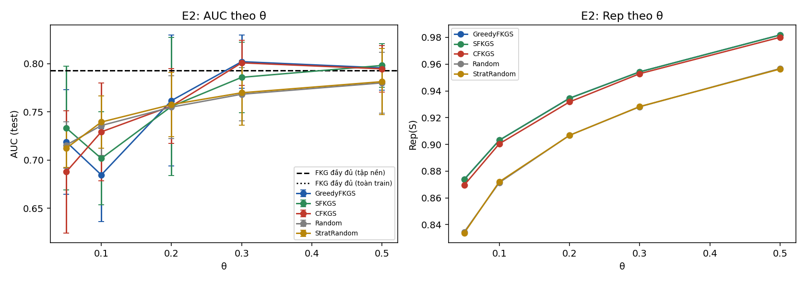
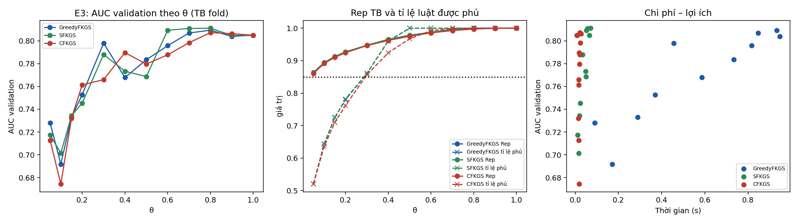
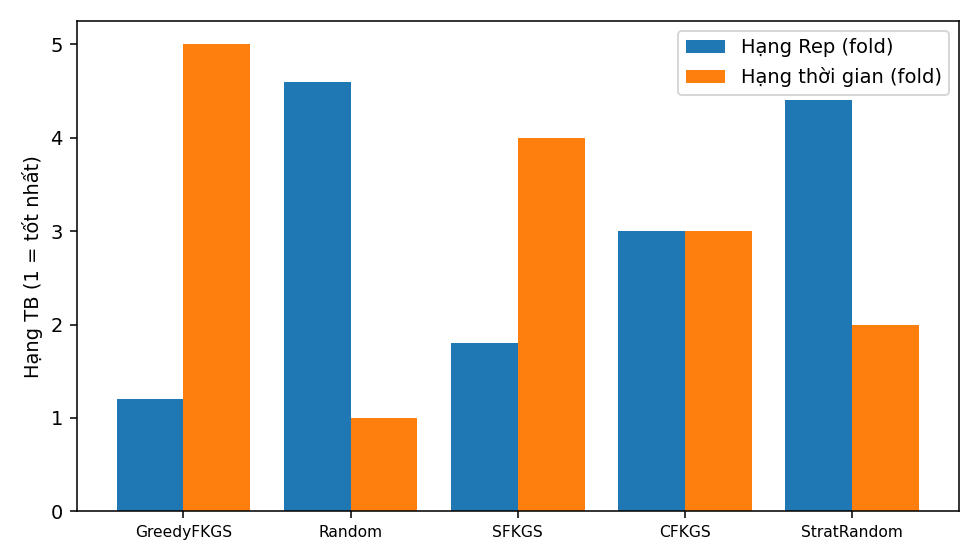

# Báo cáo thực nghiệm FKGS v3 — bộ dữ liệu `heart`

| Mục | Giá trị |
|---|---|
| run_id | `20260929T220631-e80a5e9c` |
| Mã nguồn (SHA-256 tổng hợp) | `8bfe68eff198365d…` |
| Dữ liệu | real `data\heart\Data.csv` SHA-256 `948420b084d8a3a0…` |
| Tiền xử lý | 918 dòng → 918 sau loại 0 trùng; nhãn {'0': 410, '1': 508}; X trùng khác nhãn: 0 |
| Chia dữ liệu | 5-fold phân tầng, seed 42; tập nền N_EXP=1500 |
| Điền giá trị thiếu | trung vị toàn cục của train (chỉ X), cùng quy tắc train/test |
| Nhân Sim / Rep | 1−Hamming cùng nhãn, −1 khác nhãn; Rep dùng max(0,Sim) |
| FISA | PAIR_SCOPE=`global`, điểm AUC = D1−D0 |
| Ngân sách | `exact` (mọi phương pháp chọn đúng ceil(θn) luật) |
| Môi trường | Python 3.12.1, numpy 1.26.4, scipy 1.13.0, sklearn 1.7.0, Windows-11-10.0.26100-SP0 |
| Chế độ | đầy đủ |

## E1 — Kiểm chứng cận lý thuyết (RQ1)

120 mẫu con từ luật huấn luyện fold 0 (vét cạn). Cận 1−1/e = 0.6321.

| n | m | m/n thực | Greedy ρ TB / min | SFKGS Rep/OPT_pb min | SFKGS tỉ lệ cục bộ min | SFKGS max\|g\| | CFKGS Rep/OPT_pb min | CFKGS min g |
|---|---|---|---|---|---|---|---|---|
| 10 | 2 | 0.200 | 1.0000 / 1.0000 | 0.9861 | 0.9861 | 2.2e-16 | 1.0000 | 1.1e-16 |
| 10 | 4 | 0.400 | 0.9989 / 0.9889 | 0.9889 | 0.9783 | 2.2e-16 | 1.0000 | -1.1e-16 |
| 14 | 3 | 0.214 | 0.9996 / 0.9918 | 0.9813 | 0.9672 | 2.2e-16 | 1.0522 | 3.9e-02 |
| 14 | 6 | 0.429 | 0.9970 / 0.9853 | 0.9762 | 0.9706 | 2.2e-16 | 0.9852 | -2.2e-16 |
| 18 | 4 | 0.222 | 0.9987 / 0.9872 | 0.9758 | 0.9545 | 2.2e-16 | 1.0000 | -1.1e-16 |
| 18 | 7 | 0.389 | 0.9986 / 0.9886 | 0.9886 | 0.9649 | 2.2e-16 | 0.9942 | 0.0e+00 |

Số vi phạm: greedy=0, sfkgs=0, cfkgs=0, sfkgs_decomposition=0, cfkgs_negative_g=0, chain=0, classdev_sfkgs=0, classdev_cfkgs=0, greedy_above_opt=0, size_mismatch=0

## E2 — So sánh với FKG đầy đủ và lấy mẫu cơ sở, cùng ngân sách (RQ2)

Đơn vị suy luận: fold (n = số fold); Random/StratRandom lấy trung bình theo hạt giống trong fold. Các fold có tập huấn luyện chồng lấp nên p-value mang tính mô tả trong phạm vi bộ dữ liệu.

| Mốc | \|R\| | AUC | Balanced Acc | Accuracy |
|---|---|---|---|---|
| FKG đầy đủ (tập nền) | 734 | 0.7930 ± 0.0287 | 0.5012 | 0.5545 |
| FKG đầy đủ (toàn train) | 734 | 0.7930 ± 0.0287 | 0.5012 | 0.5545 |

| θ | Phương pháp | \|S\| | Rep | Tỉ lệ luật phủ (≥δ) | AUC | Balanced Acc | Lớp+ trong mẫu | t chọn (s) |
|---|---|---|---|---|---|---|---|---|
| 0.05 | GreedyFKGS | 37 | 0.8739 ± 0.0020 | 0.569 | 0.7190 ± 0.0542 | 0.5080 | 0.541 | 0.183 |
| 0.05 | SFKGS | 37 | 0.8737 ± 0.0019 | 0.566 | 0.7333 ± 0.0641 | 0.5100 | 0.541 | 0.048 |
| 0.05 | CFKGS | 37 | 0.8696 ± 0.0024 | 0.553 | 0.6878 ± 0.0633 | 0.5049 | 0.541 | 0.012 |
| 0.05 | Random | 37 | 0.8345 ± 0.0021 | 0.402 | 0.7156 ± 0.0241 | 0.5185 | 0.540 | 0.000 |
| 0.05 | StratRandom | 37 | 0.8338 ± 0.0024 | 0.396 | 0.7122 ± 0.0198 | 0.5328 | 0.541 | 0.000 |
| 0.1 | GreedyFKGS | 74 | 0.9031 ± 0.0015 | 0.690 | 0.6847 ± 0.0482 | 0.5024 | 0.543 | 0.340 |
| 0.1 | SFKGS | 74 | 0.9031 ± 0.0014 | 0.689 | 0.7017 ± 0.0482 | 0.5012 | 0.554 | 0.058 |
| 0.1 | CFKGS | 74 | 0.9005 ± 0.0014 | 0.678 | 0.7293 ± 0.0507 | 0.5012 | 0.554 | 0.013 |
| 0.1 | Random | 74 | 0.8715 ± 0.0012 | 0.551 | 0.7358 ± 0.0309 | 0.5268 | 0.551 | 0.000 |
| 0.1 | StratRandom | 74 | 0.8721 ± 0.0017 | 0.554 | 0.7394 ± 0.0270 | 0.5059 | 0.554 | 0.000 |
| 0.2 | GreedyFKGS | 147 | 0.9345 ± 0.0009 | 0.815 | 0.7617 ± 0.0680 | 0.5424 | 0.517 | 0.638 |
| 0.2 | SFKGS | 147 | 0.9344 ± 0.0009 | 0.818 | 0.7557 ± 0.0717 | 0.5012 | 0.551 | 0.113 |
| 0.2 | CFKGS | 147 | 0.9318 ± 0.0009 | 0.798 | 0.7560 ± 0.0388 | 0.5012 | 0.551 | 0.014 |
| 0.2 | Random | 147 | 0.9068 ± 0.0008 | 0.700 | 0.7549 ± 0.0325 | 0.5255 | 0.551 | 0.000 |
| 0.2 | StratRandom | 147 | 0.9068 ± 0.0013 | 0.700 | 0.7575 ± 0.0331 | 0.5032 | 0.551 | 0.000 |
| 0.3 | GreedyFKGS | 221 | 0.9542 ± 0.0009 | 0.896 | 0.8020 ± 0.0276 | 0.5144 | 0.538 | 1.014 |
| 0.3 | SFKGS | 221 | 0.9542 ± 0.0009 | 0.896 | 0.7858 ± 0.0366 | 0.5012 | 0.552 | 0.165 |
| 0.3 | CFKGS | 221 | 0.9529 ± 0.0007 | 0.886 | 0.8008 ± 0.0235 | 0.5024 | 0.552 | 0.018 |
| 0.3 | Random | 221 | 0.9282 ± 0.0007 | 0.783 | 0.7682 ± 0.0275 | 0.5211 | 0.551 | 0.000 |
| 0.3 | StratRandom | 221 | 0.9283 ± 0.0011 | 0.783 | 0.7698 ± 0.0334 | 0.5019 | 0.552 | 0.000 |
| 0.5 | GreedyFKGS | 367 | 0.9818 ± 0.0003 | 1.000 | 0.7956 ± 0.0233 | 0.5049 | 0.550 | 1.597 |
| 0.5 | SFKGS | 367 | 0.9818 ± 0.0003 | 1.000 | 0.7981 ± 0.0228 | 0.5049 | 0.554 | 0.211 |
| 0.5 | CFKGS | 367 | 0.9801 ± 0.0007 | 0.981 | 0.7946 ± 0.0241 | 0.5049 | 0.554 | 0.021 |
| 0.5 | Random | 367 | 0.9567 ± 0.0004 | 0.882 | 0.7800 ± 0.0316 | 0.5073 | 0.555 | 0.000 |
| 0.5 | StratRandom | 367 | 0.9564 ± 0.0009 | 0.881 | 0.7813 ± 0.0342 | 0.5015 | 0.554 | 0.000 |

Kiểm định Wilcoxon một phía (phương pháp > đối chứng), đơn vị fold, Holm trong từng họ (độ đo × đối chứng):

| Độ đo | Đối chứng | θ | Phương pháp | Chênh TB | CI95 (t) | Fold tốt hơn | Tỉ lệ seed bị vượt | p | p Holm |
|---|---|---|---|---|---|---|---|---|---|
| rep | Random | 0.05 | GreedyFKGS | +0.0394 | [0.0375; 0.0412] | 5/5 | 1.00 | 0.0312 | 0.4688 |
| rep | Random | 0.05 | SFKGS | +0.0392 | [0.0374; 0.0411] | 5/5 | 1.00 | 0.0312 | 0.4688 |
| rep | Random | 0.05 | CFKGS | +0.0351 | [0.0339; 0.0362] | 5/5 | 1.00 | 0.0312 | 0.4688 |
| rep | Random | 0.1 | GreedyFKGS | +0.0317 | [0.0303; 0.0330] | 5/5 | 1.00 | 0.0312 | 0.4688 |
| rep | Random | 0.1 | SFKGS | +0.0317 | [0.0303; 0.0330] | 5/5 | 1.00 | 0.0312 | 0.4688 |
| rep | Random | 0.1 | CFKGS | +0.0290 | [0.0280; 0.0300] | 5/5 | 1.00 | 0.0312 | 0.4688 |
| rep | Random | 0.2 | GreedyFKGS | +0.0277 | [0.0272; 0.0283] | 5/5 | 1.00 | 0.0312 | 0.4688 |
| rep | Random | 0.2 | SFKGS | +0.0276 | [0.0271; 0.0282] | 5/5 | 1.00 | 0.0312 | 0.4688 |
| rep | Random | 0.2 | CFKGS | +0.0250 | [0.0244; 0.0255] | 5/5 | 1.00 | 0.0312 | 0.4688 |
| rep | Random | 0.3 | GreedyFKGS | +0.0261 | [0.0254; 0.0268] | 5/5 | 1.00 | 0.0312 | 0.4688 |
| rep | Random | 0.3 | SFKGS | +0.0261 | [0.0254; 0.0268] | 5/5 | 1.00 | 0.0312 | 0.4688 |
| rep | Random | 0.3 | CFKGS | +0.0247 | [0.0246; 0.0248] | 5/5 | 1.00 | 0.0312 | 0.4688 |
| rep | Random | 0.5 | GreedyFKGS | +0.0251 | [0.0245; 0.0257] | 5/5 | 1.00 | 0.0312 | 0.4688 |
| rep | Random | 0.5 | SFKGS | +0.0251 | [0.0245; 0.0257] | 5/5 | 1.00 | 0.0312 | 0.4688 |
| rep | Random | 0.5 | CFKGS | +0.0234 | [0.0225; 0.0242] | 5/5 | 1.00 | 0.0312 | 0.4688 |
| rep | StratRandom | 0.05 | GreedyFKGS | +0.0401 | [0.0377; 0.0424] | 5/5 | 1.00 | 0.0312 | 0.4688 |
| rep | StratRandom | 0.05 | SFKGS | +0.0399 | [0.0376; 0.0423] | 5/5 | 1.00 | 0.0312 | 0.4688 |
| rep | StratRandom | 0.05 | CFKGS | +0.0358 | [0.0328; 0.0387] | 5/5 | 1.00 | 0.0312 | 0.4688 |
| rep | StratRandom | 0.1 | GreedyFKGS | +0.0311 | [0.0289; 0.0333] | 5/5 | 1.00 | 0.0312 | 0.4688 |
| rep | StratRandom | 0.1 | SFKGS | +0.0311 | [0.0288; 0.0333] | 5/5 | 1.00 | 0.0312 | 0.4688 |
| rep | StratRandom | 0.1 | CFKGS | +0.0284 | [0.0267; 0.0302] | 5/5 | 1.00 | 0.0312 | 0.4688 |
| rep | StratRandom | 0.2 | GreedyFKGS | +0.0278 | [0.0269; 0.0286] | 5/5 | 1.00 | 0.0312 | 0.4688 |
| rep | StratRandom | 0.2 | SFKGS | +0.0277 | [0.0267; 0.0286] | 5/5 | 1.00 | 0.0312 | 0.4688 |
| rep | StratRandom | 0.2 | CFKGS | +0.0250 | [0.0240; 0.0260] | 5/5 | 1.00 | 0.0312 | 0.4688 |
| rep | StratRandom | 0.3 | GreedyFKGS | +0.0260 | [0.0250; 0.0269] | 5/5 | 1.00 | 0.0312 | 0.4688 |
| rep | StratRandom | 0.3 | SFKGS | +0.0260 | [0.0250; 0.0269] | 5/5 | 1.00 | 0.0312 | 0.4688 |
| rep | StratRandom | 0.3 | CFKGS | +0.0246 | [0.0236; 0.0256] | 5/5 | 1.00 | 0.0312 | 0.4688 |
| rep | StratRandom | 0.5 | GreedyFKGS | +0.0255 | [0.0243; 0.0266] | 5/5 | 1.00 | 0.0312 | 0.4688 |
| rep | StratRandom | 0.5 | SFKGS | +0.0255 | [0.0243; 0.0266] | 5/5 | 1.00 | 0.0312 | 0.4688 |
| rep | StratRandom | 0.5 | CFKGS | +0.0237 | [0.0226; 0.0248] | 5/5 | 1.00 | 0.0312 | 0.4688 |
| auc | Random | 0.05 | GreedyFKGS | +0.0034 | [-0.0458; 0.0526] | 3/5 | 0.50 | 0.5000 | 1.0000 |
| auc | Random | 0.05 | SFKGS | +0.0177 | [-0.0578; 0.0933] | 3/5 | 0.56 | 0.3125 | 1.0000 |
| auc | Random | 0.05 | CFKGS | -0.0278 | [-0.0908; 0.0352] | 1/5 | 0.33 | 0.8438 | 1.0000 |
| auc | Random | 0.1 | GreedyFKGS | -0.0511 | [-0.0758; -0.0264] | 0/5 | 0.15 | 1.0000 | 1.0000 |
| auc | Random | 0.1 | SFKGS | -0.0341 | [-0.0610; -0.0072] | 0/5 | 0.26 | 1.0000 | 1.0000 |
| auc | Random | 0.1 | CFKGS | -0.0066 | [-0.0528; 0.0397] | 2/5 | 0.39 | 0.5938 | 1.0000 |
| auc | Random | 0.2 | GreedyFKGS | +0.0068 | [-0.0444; 0.0581] | 4/5 | 0.57 | 0.3125 | 1.0000 |
| auc | Random | 0.2 | SFKGS | +0.0008 | [-0.0681; 0.0696] | 3/5 | 0.58 | 0.4062 | 1.0000 |
| auc | Random | 0.2 | CFKGS | +0.0011 | [-0.0254; 0.0277] | 1/5 | 0.45 | 0.7812 | 1.0000 |
| auc | Random | 0.3 | GreedyFKGS | +0.0338 | [0.0118; 0.0557] | 5/5 | 0.81 | 0.0312 | 0.4688 |
| auc | Random | 0.3 | SFKGS | +0.0175 | [0.0028; 0.0323] | 4/5 | 0.61 | 0.0625 | 0.6250 |
| auc | Random | 0.3 | CFKGS | +0.0325 | [0.0114; 0.0537] | 5/5 | 0.81 | 0.0312 | 0.4688 |
| auc | Random | 0.5 | GreedyFKGS | +0.0156 | [0.0003; 0.0308] | 5/5 | 0.68 | 0.0312 | 0.4688 |
| auc | Random | 0.5 | SFKGS | +0.0181 | [-0.0031; 0.0392] | 5/5 | 0.70 | 0.0312 | 0.4688 |
| auc | Random | 0.5 | CFKGS | +0.0145 | [0.0004; 0.0287] | 5/5 | 0.65 | 0.0312 | 0.4688 |
| auc | StratRandom | 0.05 | GreedyFKGS | +0.0068 | [-0.0524; 0.0659] | 2/5 | 0.50 | 0.5000 | 1.0000 |
| auc | StratRandom | 0.05 | SFKGS | +0.0211 | [-0.0531; 0.0953] | 3/5 | 0.57 | 0.2188 | 1.0000 |
| auc | StratRandom | 0.05 | CFKGS | -0.0244 | [-0.0916; 0.0427] | 1/5 | 0.34 | 0.8438 | 1.0000 |
| auc | StratRandom | 0.1 | GreedyFKGS | -0.0547 | [-0.0844; -0.0251] | 0/5 | 0.13 | 1.0000 | 1.0000 |
| auc | StratRandom | 0.1 | SFKGS | -0.0377 | [-0.0674; -0.0080] | 1/5 | 0.23 | 0.9688 | 1.0000 |
| auc | StratRandom | 0.1 | CFKGS | -0.0102 | [-0.0545; 0.0342] | 2/5 | 0.43 | 0.5938 | 1.0000 |
| auc | StratRandom | 0.2 | GreedyFKGS | +0.0042 | [-0.0462; 0.0545] | 4/5 | 0.55 | 0.3125 | 1.0000 |
| auc | StratRandom | 0.2 | SFKGS | -0.0019 | [-0.0753; 0.0715] | 3/5 | 0.56 | 0.4062 | 1.0000 |
| auc | StratRandom | 0.2 | CFKGS | -0.0015 | [-0.0233; 0.0203] | 1/5 | 0.43 | 0.7812 | 1.0000 |
| auc | StratRandom | 0.3 | GreedyFKGS | +0.0322 | [0.0110; 0.0535] | 5/5 | 0.81 | 0.0312 | 0.4688 |
| auc | StratRandom | 0.3 | SFKGS | +0.0160 | [0.0046; 0.0274] | 5/5 | 0.64 | 0.0312 | 0.4688 |
| auc | StratRandom | 0.3 | CFKGS | +0.0310 | [0.0065; 0.0555] | 5/5 | 0.80 | 0.0312 | 0.4688 |
| auc | StratRandom | 0.5 | GreedyFKGS | +0.0143 | [-0.0037; 0.0322] | 4/5 | 0.60 | 0.0625 | 0.7500 |
| auc | StratRandom | 0.5 | SFKGS | +0.0168 | [-0.0065; 0.0400] | 4/5 | 0.67 | 0.0625 | 0.7500 |
| auc | StratRandom | 0.5 | CFKGS | +0.0132 | [-0.0035; 0.0300] | 4/5 | 0.62 | 0.0625 | 0.7500 |
| auc | FKG_full_pool | 0.05 | GreedyFKGS | -0.0740 | [-0.1173; -0.0307] | 0/5 | — | 1.0000 | 1.0000 |
| auc | FKG_full_pool | 0.05 | SFKGS | -0.0597 | [-0.1354; 0.0161] | 1/5 | — | 0.9688 | 1.0000 |
| auc | FKG_full_pool | 0.05 | CFKGS | -0.1052 | [-0.1592; -0.0511] | 0/5 | — | 1.0000 | 1.0000 |
| auc | FKG_full_pool | 0.1 | GreedyFKGS | -0.1083 | [-0.1420; -0.0745] | 0/5 | — | 1.0000 | 1.0000 |
| auc | FKG_full_pool | 0.1 | SFKGS | -0.0912 | [-0.1210; -0.0614] | 0/5 | — | 1.0000 | 1.0000 |
| auc | FKG_full_pool | 0.1 | CFKGS | -0.0637 | [-0.1002; -0.0272] | 0/5 | — | 1.0000 | 1.0000 |
| auc | FKG_full_pool | 0.2 | GreedyFKGS | -0.0313 | [-0.0836; 0.0211] | 1/5 | — | 0.9375 | 1.0000 |
| auc | FKG_full_pool | 0.2 | SFKGS | -0.0373 | [-0.1090; 0.0344] | 2/5 | — | 0.8438 | 1.0000 |
| auc | FKG_full_pool | 0.2 | CFKGS | -0.0369 | [-0.0606; -0.0133] | 0/5 | — | 1.0000 | 1.0000 |
| auc | FKG_full_pool | 0.3 | GreedyFKGS | +0.0091 | [-0.0124; 0.0305] | 3/5 | — | 0.3125 | 1.0000 |
| auc | FKG_full_pool | 0.3 | SFKGS | -0.0072 | [-0.0215; 0.0071] | 1/5 | — | 0.9062 | 1.0000 |
| auc | FKG_full_pool | 0.3 | CFKGS | +0.0078 | [-0.0134; 0.0291] | 3/5 | — | 0.3125 | 1.0000 |
| auc | FKG_full_pool | 0.5 | GreedyFKGS | +0.0026 | [-0.0080; 0.0132] | 3/5 | — | 0.4062 | 1.0000 |
| auc | FKG_full_pool | 0.5 | SFKGS | +0.0051 | [-0.0117; 0.0219] | 3/5 | — | 0.4062 | 1.0000 |
| auc | FKG_full_pool | 0.5 | CFKGS | +0.0016 | [-0.0082; 0.0114] | 2/5 | — | 0.5938 | 1.0000 |

## E3 — Đường cong theo θ, chọn θ* trên validation (RQ3)

θ* = điểm gối trên mặt Pareto (chi phí = chọn luật + xây FISA + suy diễn; lợi ích = AUC validation). Test chỉ dùng để đánh giá tại θ*. Ngưỡng Rep trung bình = 0.85; phủ toàn phần = mọi luật có cov ≥ 0.85.

| Phương pháp | θ* theo fold | \|S\| TB tại θ* | AUC test tại θ* | AUC test FKG đầy đủ | θ nhỏ nhất Rep TB ≥ ngưỡng | θ nhỏ nhất phủ toàn phần |
|---|---|---|---|---|---|---|
| GreedyFKGS | 0.3, 0.6, 0.6, 0.4, 0.7 | 382 | 0.8010 ± 0.0275 | 0.7930 | 0.05, 0.05, 0.05, 0.05, 0.05 | 0.5, 0.5, 0.5, 0.5, 0.5 |
| SFKGS | 0.4, 0.6, 0.8, 0.3, 0.6 | 397 | 0.7917 ± 0.0326 | 0.7930 | 0.05, 0.05, 0.05, 0.05, 0.05 | 0.5, 0.5, 0.5, 0.5, 0.5 |
| CFKGS | 0.4, 0.2, 0.5, 0.4, 0.8 | 338 | 0.7855 ± 0.0257 | 0.7930 | 0.05, 0.05, 0.05, 0.05, 0.05 | 0.7, 0.7, 0.7, 0.8, 0.7 |

## E4 — So sánh các chiến lược tại θ = 0.2, cùng ngân sách (RQ4)

| Phương pháp | \|S\| | Rep TB ± ĐLC | Tỉ lệ luật phủ | Lớp+ | Thời gian (ms) |
|---|---|---|---|---|---|
| GreedyFKGS | 100 | 0.9235 ± 0.0023 | 0.756 | 0.531 | 243.3 |
| Random | 100 | 0.8952 ± 0.0036 | 0.645 | 0.559 | 0.1 |
| SFKGS | 100 | 0.9235 ± 0.0023 | 0.756 | 0.550 | 15.6 |
| CFKGS | 100 | 0.9206 ± 0.0023 | 0.743 | 0.550 | 10.3 |
| StratRandom | 100 | 0.8955 ± 0.0043 | 0.646 | 0.550 | 0.1 |

**Rep, 5 block = trung bình fold (chính):** Friedman χ²=18.400, p=0.0010, CD=2.728 (5 block). Hạng: GreedyFKGS=1.20, Random=4.60, SFKGS=1.80, CFKGS=3.00, StratRandom=4.40. Cặp khác biệt: GreedyFKGS–Random, GreedyFKGS–StratRandom, Random–SFKGS

**Rep, 50 block (mô tả, có điều kiện trên fold):** Friedman χ²=186.617, p=2.83e-39, CD=0.863 (50 block). Hạng: GreedyFKGS=1.42, Random=4.52, SFKGS=1.58, CFKGS=3.00, StratRandom=4.48. Cặp khác biệt: GreedyFKGS–Random, GreedyFKGS–CFKGS, GreedyFKGS–StratRandom, Random–SFKGS, Random–CFKGS, SFKGS–CFKGS, SFKGS–StratRandom, CFKGS–StratRandom

**Thời gian, trung bình fold:** Friedman χ²=20.000, p=4.99e-04, CD=2.728 (5 block). Hạng: GreedyFKGS=5.00, Random=1.00, SFKGS=4.00, CFKGS=3.00, StratRandom=2.00. Cặp khác biệt: GreedyFKGS–Random, GreedyFKGS–StratRandom, Random–SFKGS

