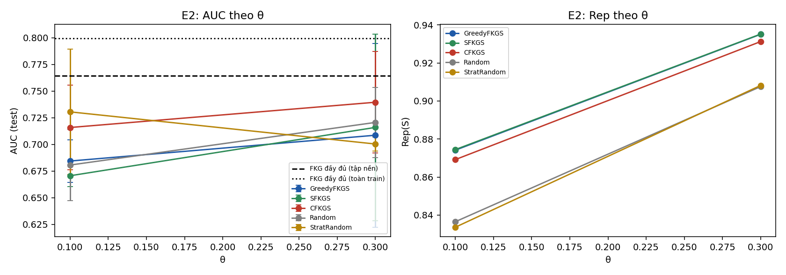
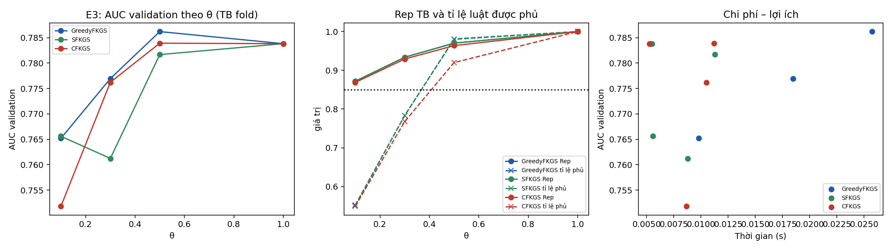
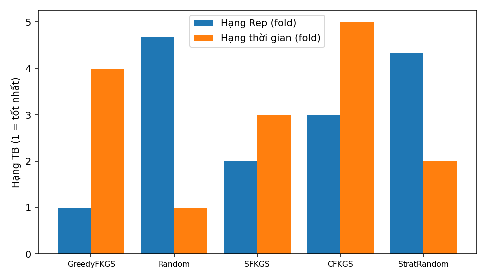

# Báo cáo thực nghiệm FKGS v3 — bộ dữ liệu `heart`

| Mục | Giá trị |
|---|---|
| run_id | `20260929T221045-bc9c6372` |
| Mã nguồn (SHA-256 tổng hợp) | `8bfe68eff198365d…` |
| Dữ liệu | real `data\heart\Data.csv` SHA-256 `948420b084d8a3a0…` |
| Tiền xử lý | 918 dòng → 918 sau loại 0 trùng; nhãn {'0': 410, '1': 508}; X trùng khác nhãn: 0 |
| Chia dữ liệu | 3-fold phân tầng, seed 42; tập nền N_EXP=300 |
| Điền giá trị thiếu | trung vị toàn cục của train (chỉ X), cùng quy tắc train/test |
| Nhân Sim / Rep | 1−Hamming cùng nhãn, −1 khác nhãn; Rep dùng max(0,Sim) |
| FISA | PAIR_SCOPE=`global`, điểm AUC = D1−D0 |
| Ngân sách | `exact` (mọi phương pháp chọn đúng ceil(θn) luật) |
| Môi trường | Python 3.12.1, numpy 1.26.4, scipy 1.13.0, sklearn 1.7.0, Windows-11-10.0.26100-SP0 |
| Chế độ | QUICK (không dùng để báo cáo) |

## E1 — Kiểm chứng cận lý thuyết (RQ1)

12 mẫu con từ luật huấn luyện fold 0 (vét cạn). Cận 1−1/e = 0.6321.

| n | m | m/n thực | Greedy ρ TB / min | SFKGS Rep/OPT_pb min | SFKGS tỉ lệ cục bộ min | SFKGS max\|g\| | CFKGS Rep/OPT_pb min | CFKGS min g |
|---|---|---|---|---|---|---|---|---|
| 10 | 2 | 0.200 | 1.0000 / 1.0000 | 0.9857 | 0.9857 | 1.1e-16 | 1.0938 | 5.5e-02 |
| 10 | 4 | 0.400 | 0.9965 / 0.9896 | 0.9896 | 0.9867 | 1.1e-16 | 1.0833 | 6.4e-02 |
| 12 | 2 | 0.167 | 1.0000 / 1.0000 | 1.0000 | 1.0000 | 1.1e-16 | 1.3382 | 1.7e-01 |
| 12 | 5 | 0.417 | 0.9944 / 0.9831 | 0.9831 | 0.9655 | 3.3e-16 | 1.0000 | 0.0e+00 |

Số vi phạm: greedy=0, sfkgs=0, cfkgs=0, sfkgs_decomposition=0, cfkgs_negative_g=0, chain=0, classdev_sfkgs=0, classdev_cfkgs=0, greedy_above_opt=0, size_mismatch=0

## E2 — So sánh với FKG đầy đủ và lấy mẫu cơ sở, cùng ngân sách (RQ2)

Đơn vị suy luận: fold (n = số fold); Random/StratRandom lấy trung bình theo hạt giống trong fold. Các fold có tập huấn luyện chồng lấp nên p-value mang tính mô tả trong phạm vi bộ dữ liệu.

| Mốc | \|R\| | AUC | Balanced Acc | Accuracy |
|---|---|---|---|---|
| FKG đầy đủ (tập nền) | 300 | 0.7643 ± 0.0085 | 0.5012 | 0.5545 |
| FKG đầy đủ (toàn train) | 612 | 0.7994 ± 0.0176 | 0.5012 | 0.5545 |

| θ | Phương pháp | \|S\| | Rep | Tỉ lệ luật phủ (≥δ) | AUC | Balanced Acc | Lớp+ trong mẫu | t chọn (s) |
|---|---|---|---|---|---|---|---|---|
| 0.1 | GreedyFKGS | 30 | 0.8741 ± 0.0045 | 0.558 | 0.6844 ± 0.0201 | 0.5058 | 0.533 | 0.006 |
| 0.1 | SFKGS | 30 | 0.8744 ± 0.0041 | 0.563 | 0.6706 ± 0.0100 | 0.5012 | 0.567 | 0.002 |
| 0.1 | CFKGS | 30 | 0.8692 ± 0.0038 | 0.541 | 0.7158 ± 0.0397 | 0.5012 | 0.567 | 0.005 |
| 0.1 | Random | 30 | 0.8365 ± 0.0056 | 0.406 | 0.6806 ± 0.0334 | 0.5123 | 0.585 | 0.000 |
| 0.1 | StratRandom | 30 | 0.8336 ± 0.0009 | 0.395 | 0.7305 ± 0.0587 | 0.5045 | 0.567 | 0.000 |
| 0.3 | GreedyFKGS | 90 | 0.9351 ± 0.0029 | 0.793 | 0.7086 ± 0.0862 | 0.5149 | 0.537 | 0.015 |
| 0.3 | SFKGS | 90 | 0.9352 ± 0.0024 | 0.793 | 0.7159 ± 0.0875 | 0.5012 | 0.556 | 0.007 |
| 0.3 | CFKGS | 90 | 0.9312 ± 0.0022 | 0.773 | 0.7395 ± 0.0476 | 0.5012 | 0.556 | 0.008 |
| 0.3 | Random | 90 | 0.9075 ± 0.0019 | 0.677 | 0.7206 ± 0.0329 | 0.5032 | 0.554 | 0.000 |
| 0.3 | StratRandom | 90 | 0.9081 ± 0.0030 | 0.685 | 0.7004 ± 0.0065 | 0.5004 | 0.556 | 0.000 |

Kiểm định Wilcoxon một phía (phương pháp > đối chứng), đơn vị fold, Holm trong từng họ (độ đo × đối chứng):

| Độ đo | Đối chứng | θ | Phương pháp | Chênh TB | CI95 (t) | Fold tốt hơn | Tỉ lệ seed bị vượt | p | p Holm |
|---|---|---|---|---|---|---|---|---|---|
| rep | Random | 0.1 | GreedyFKGS | +0.0376 | [0.0349; 0.0403] | 3/3 | 1.00 | 0.1250 | 0.7500 |
| rep | Random | 0.1 | SFKGS | +0.0379 | [0.0341; 0.0417] | 3/3 | 1.00 | 0.1250 | 0.7500 |
| rep | Random | 0.1 | CFKGS | +0.0327 | [0.0264; 0.0389] | 3/3 | 1.00 | 0.1250 | 0.7500 |
| rep | Random | 0.3 | GreedyFKGS | +0.0275 | [0.0232; 0.0318] | 3/3 | 1.00 | 0.1250 | 0.7500 |
| rep | Random | 0.3 | SFKGS | +0.0276 | [0.0242; 0.0310] | 3/3 | 1.00 | 0.1250 | 0.7500 |
| rep | Random | 0.3 | CFKGS | +0.0237 | [0.0202; 0.0272] | 3/3 | 1.00 | 0.1250 | 0.7500 |
| rep | StratRandom | 0.1 | GreedyFKGS | +0.0405 | [0.0272; 0.0538] | 3/3 | 1.00 | 0.1250 | 0.7500 |
| rep | StratRandom | 0.1 | SFKGS | +0.0408 | [0.0286; 0.0530] | 3/3 | 1.00 | 0.1250 | 0.7500 |
| rep | StratRandom | 0.1 | CFKGS | +0.0356 | [0.0238; 0.0473] | 3/3 | 1.00 | 0.1250 | 0.7500 |
| rep | StratRandom | 0.3 | GreedyFKGS | +0.0269 | [0.0253; 0.0285] | 3/3 | 1.00 | 0.1250 | 0.7500 |
| rep | StratRandom | 0.3 | SFKGS | +0.0270 | [0.0250; 0.0290] | 3/3 | 1.00 | 0.1250 | 0.7500 |
| rep | StratRandom | 0.3 | CFKGS | +0.0231 | [0.0203; 0.0258] | 3/3 | 1.00 | 0.1250 | 0.7500 |
| auc | Random | 0.1 | GreedyFKGS | +0.0038 | [-0.1284; 0.1359] | 1/3 | 0.44 | 0.6250 | 1.0000 |
| auc | Random | 0.1 | SFKGS | -0.0100 | [-0.0764; 0.0563] | 1/3 | 0.44 | 0.7500 | 1.0000 |
| auc | Random | 0.1 | CFKGS | +0.0352 | [-0.0728; 0.1432] | 2/3 | 0.78 | 0.2500 | 1.0000 |
| auc | Random | 0.3 | GreedyFKGS | -0.0120 | [-0.2669; 0.2429] | 1/3 | 0.33 | 0.6250 | 1.0000 |
| auc | Random | 0.3 | SFKGS | -0.0047 | [-0.2575; 0.2481] | 1/3 | 0.44 | 0.6250 | 1.0000 |
| auc | Random | 0.3 | CFKGS | +0.0189 | [-0.1805; 0.2183] | 2/3 | 0.56 | 0.3750 | 1.0000 |
| auc | StratRandom | 0.1 | GreedyFKGS | -0.0461 | [-0.2416; 0.1494] | 1/3 | 0.33 | 0.8750 | 1.0000 |
| auc | StratRandom | 0.1 | SFKGS | -0.0599 | [-0.1943; 0.0745] | 0/3 | 0.11 | 1.0000 | 1.0000 |
| auc | StratRandom | 0.1 | CFKGS | -0.0147 | [-0.1351; 0.1058] | 1/3 | 0.44 | 0.7500 | 1.0000 |
| auc | StratRandom | 0.3 | GreedyFKGS | +0.0082 | [-0.2190; 0.2355] | 2/3 | 0.44 | 0.3750 | 1.0000 |
| auc | StratRandom | 0.3 | SFKGS | +0.0156 | [-0.2141; 0.2452] | 2/3 | 0.67 | 0.3750 | 1.0000 |
| auc | StratRandom | 0.3 | CFKGS | +0.0392 | [-0.0942; 0.1726] | 2/3 | 0.67 | 0.2500 | 1.0000 |
| auc | FKG_full_pool | 0.1 | GreedyFKGS | -0.0799 | [-0.1294; -0.0304] | 0/3 | — | 1.0000 | 1.0000 |
| auc | FKG_full_pool | 0.1 | SFKGS | -0.0937 | [-0.1132; -0.0741] | 0/3 | — | 1.0000 | 1.0000 |
| auc | FKG_full_pool | 0.1 | CFKGS | -0.0484 | [-0.1674; 0.0705] | 1/3 | — | 0.8750 | 1.0000 |
| auc | FKG_full_pool | 0.3 | GreedyFKGS | -0.0557 | [-0.2612; 0.1498] | 1/3 | — | 0.8750 | 1.0000 |
| auc | FKG_full_pool | 0.3 | SFKGS | -0.0483 | [-0.2555; 0.1588] | 1/3 | — | 0.8750 | 1.0000 |
| auc | FKG_full_pool | 0.3 | CFKGS | -0.0247 | [-0.1554; 0.1059] | 1/3 | — | 0.7500 | 1.0000 |

## E3 — Đường cong theo θ, chọn θ* trên validation (RQ3)

θ* = điểm gối trên mặt Pareto (chi phí = chọn luật + xây FISA + suy diễn; lợi ích = AUC validation). Test chỉ dùng để đánh giá tại θ*. Ngưỡng Rep trung bình = 0.85; phủ toàn phần = mọi luật có cov ≥ 0.85.

| Phương pháp | θ* theo fold | \|S\| TB tại θ* | AUC test tại θ* | AUC test FKG đầy đủ | θ nhỏ nhất Rep TB ≥ ngưỡng | θ nhỏ nhất phủ toàn phần |
|---|---|---|---|---|---|---|
| GreedyFKGS | 0.5, 1.0, 0.1 | 160 | 0.7295 ± 0.0423 | 0.7643 | 0.1, 0.1, 0.1 | 1.0, 1.0, 1.0 |
| SFKGS | 0.3, 1.0, 0.1 | 140 | 0.7437 ± 0.0576 | 0.7643 | 0.1, 0.1, 0.1 | 1.0, 1.0, 1.0 |
| CFKGS | 0.3, 0.5, 1.0 | 180 | 0.7576 ± 0.0423 | 0.7643 | 0.1, 0.1, 0.1 | 1.0, 1.0, 1.0 |

## E4 — So sánh các chiến lược tại θ = 0.2, cùng ngân sách (RQ4)

| Phương pháp | \|S\| | Rep TB ± ĐLC | Tỉ lệ luật phủ | Lớp+ | Thời gian (ms) |
|---|---|---|---|---|---|
| GreedyFKGS | 30 | 0.8839 ± 0.0052 | 0.561 | 0.500 | 1.6 |
| Random | 30 | 0.8428 ± 0.0118 | 0.428 | 0.589 | 0.0 |
| SFKGS | 30 | 0.8832 ± 0.0056 | 0.561 | 0.567 | 0.8 |
| CFKGS | 30 | 0.8769 ± 0.0045 | 0.561 | 0.567 | 3.4 |
| StratRandom | 30 | 0.8444 ± 0.0065 | 0.423 | 0.567 | 0.1 |

**Rep, 5 block = trung bình fold (chính):** Friedman χ²=11.467, p=0.0218, CD=3.522 (3 block). Hạng: GreedyFKGS=1.00, Random=4.67, SFKGS=2.00, CFKGS=3.00, StratRandom=4.33. Cặp khác biệt: GreedyFKGS–Random

**Rep, 50 block (mô tả, có điều kiện trên fold):** Friedman χ²=22.218, p=1.81e-04, CD=2.490 (6 block). Hạng: GreedyFKGS=1.25, Random=4.33, SFKGS=1.75, CFKGS=3.00, StratRandom=4.67. Cặp khác biệt: GreedyFKGS–Random, GreedyFKGS–StratRandom, Random–SFKGS, SFKGS–StratRandom

**Thời gian, trung bình fold:** Friedman χ²=12.000, p=0.0174, CD=3.522 (3 block). Hạng: GreedyFKGS=4.00, Random=1.00, SFKGS=3.00, CFKGS=5.00, StratRandom=2.00. Cặp khác biệt: Random–CFKGS

